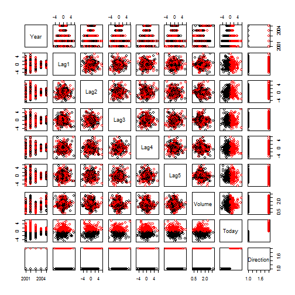
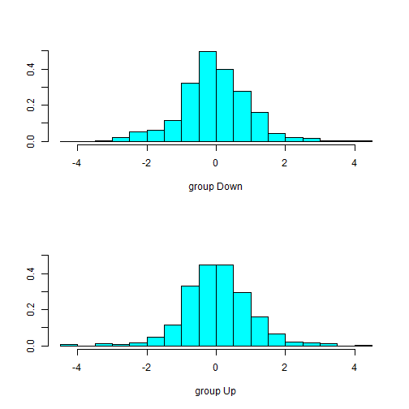

Logistic regression
========================================================

```r
require(ISLR)
```

```
## Loading required package: ISLR
```

```r
names(Smarket)
```

```
## [1] "Year"      "Lag1"      "Lag2"      "Lag3"      "Lag4"      "Lag5"     
## [7] "Volume"    "Today"     "Direction"
```

```r
summary(Smarket)
```

```
##       Year           Lag1             Lag2             Lag3       
##  Min.   :2001   Min.   :-4.922   Min.   :-4.922   Min.   :-4.922  
##  1st Qu.:2002   1st Qu.:-0.640   1st Qu.:-0.640   1st Qu.:-0.640  
##  Median :2003   Median : 0.039   Median : 0.039   Median : 0.038  
##  Mean   :2003   Mean   : 0.004   Mean   : 0.004   Mean   : 0.002  
##  3rd Qu.:2004   3rd Qu.: 0.597   3rd Qu.: 0.597   3rd Qu.: 0.597  
##  Max.   :2005   Max.   : 5.733   Max.   : 5.733   Max.   : 5.733  
##       Lag4             Lag5            Volume          Today       
##  Min.   :-4.922   Min.   :-4.922   Min.   :0.356   Min.   :-4.922  
##  1st Qu.:-0.640   1st Qu.:-0.640   1st Qu.:1.257   1st Qu.:-0.640  
##  Median : 0.038   Median : 0.038   Median :1.423   Median : 0.038  
##  Mean   : 0.002   Mean   : 0.006   Mean   :1.478   Mean   : 0.003  
##  3rd Qu.: 0.597   3rd Qu.: 0.597   3rd Qu.:1.642   3rd Qu.: 0.597  
##  Max.   : 5.733   Max.   : 5.733   Max.   :3.152   Max.   : 5.733  
##  Direction 
##  Down:602  
##  Up  :648  
##            
##            
##            
## 
```

```r
# ?Smarket
pairs(Smarket, col = Smarket$Direction)
```

 

```r
glm.fit = glm(Direction ~ Lag1 + Lag2 + Lag3 + Lag4 + Lag5 + Volume, data = Smarket, 
    family = binomial)
summary(glm.fit)
```

```
## 
## Call:
## glm(formula = Direction ~ Lag1 + Lag2 + Lag3 + Lag4 + Lag5 + 
##     Volume, family = binomial, data = Smarket)
## 
## Deviance Residuals: 
##    Min      1Q  Median      3Q     Max  
##  -1.45   -1.20    1.07    1.15    1.33  
## 
## Coefficients:
##             Estimate Std. Error z value Pr(>|z|)
## (Intercept) -0.12600    0.24074   -0.52     0.60
## Lag1        -0.07307    0.05017   -1.46     0.15
## Lag2        -0.04230    0.05009   -0.84     0.40
## Lag3         0.01109    0.04994    0.22     0.82
## Lag4         0.00936    0.04997    0.19     0.85
## Lag5         0.01031    0.04951    0.21     0.83
## Volume       0.13544    0.15836    0.86     0.39
## 
## (Dispersion parameter for binomial family taken to be 1)
## 
##     Null deviance: 1731.2  on 1249  degrees of freedom
## Residual deviance: 1727.6  on 1243  degrees of freedom
## AIC: 1742
## 
## Number of Fisher Scoring iterations: 3
```

```r
# access just the coefficients for this fitted model.
coef(glm.fit)
```

```
## (Intercept)        Lag1        Lag2        Lag3        Lag4        Lag5 
##   -0.126000   -0.073074   -0.042301    0.011085    0.009359    0.010313 
##      Volume 
##    0.135441
```

```r
summary(glm.fit)$coef
```

```
##              Estimate Std. Error z value Pr(>|z|)
## (Intercept) -0.126000    0.24074 -0.5234   0.6007
## Lag1        -0.073074    0.05017 -1.4566   0.1452
## Lag2        -0.042301    0.05009 -0.8446   0.3983
## Lag3         0.011085    0.04994  0.2220   0.8243
## Lag4         0.009359    0.04997  0.1873   0.8514
## Lag5         0.010313    0.04951  0.2083   0.8350
## Volume       0.135441    0.15836  0.8553   0.3924
```

```r
# 
glm.probs = predict(glm.fit, type = "response")
glm.probs[1:5]
```

```
##      1      2      3      4      5 
## 0.5071 0.4815 0.4811 0.5152 0.5108
```

```r
glm.pred = ifelse(glm.probs > 0.5, "Up", "Down")
attach(Smarket)
contrasts(Direction)
```

```
##      Up
## Down  0
## Up    1
```

```r
table(glm.pred, Direction)
```

```
##         Direction
## glm.pred Down  Up
##     Down  145 141
##     Up    457 507
```

```r
# to compute the fraction of days for which the prediction was correct.
mean(glm.pred == Direction)
```

```
## [1] 0.5216
```


In this case, logistic regression
correctly predicted the movement of the market 52.2% of the time.
At first glance, it appears that the logistic regression model is working
a little better than random guessing. However, this result is misleading
because we trained and tested the model on the same set of 1, 250 observations.
In other words, 100− 52.2 = 47.8% is the training error rate.

Make training and test set
The elements of the vector that correspond to
observations that occurred before 2005 are set to TRUE, whereas those that
correspond to observations in 2005 are set to FALSE.

```r
train = Year < 2005
glm.fit = glm(Direction ~ Lag1 + Lag2 + Lag3 + Lag4 + Lag5 + Volume, data = Smarket, 
    family = binomial, subset = train)
glm.probs = predict(glm.fit, newdata = Smarket[!train, ], type = "response")
glm.pred = ifelse(glm.probs > 0.5, "Up", "Down")
Direction.2005 = Smarket$Direction[!train]
table(glm.pred, Direction.2005)
```

```
##         Direction.2005
## glm.pred Down Up
##     Down   77 97
##     Up     34 44
```

```r
mean(glm.pred == Direction.2005)
```

```
## [1] 0.4802
```

```r
# Fit smaller model
glm.fit = glm(Direction ~ Lag1 + Lag2, data = Smarket, family = binomial, subset = train)
glm.probs = predict(glm.fit, newdata = Smarket[!train, ], type = "response")
glm.pred = ifelse(glm.probs > 0.5, "Up", "Down")
table(glm.pred, Direction.2005)
```

```
##         Direction.2005
## glm.pred Down  Up
##     Down   35  35
##     Up     76 106
```

```r
mean(glm.pred == Direction.2005)
```

```
## [1] 0.5595
```

```r
106/(76 + 106)
```

```
## [1] 0.5824
```


In particular, we want to predict Direction on a
day when Lag1 and Lag2 equal 1.2 and 1.1, respectively, and on a day when
they equal 1.5 and −0.8.

```r
predict(glm.fit, newdata = data.frame(Lag1 = c(1.2, 1.5), Lag2 = c(1.1, -0.8)), 
    type = "response")
```

```
##      1      2 
## 0.4791 0.4961
```


Linear Discriminant Analysis LDA
========================================================

```r
require(MASS)
```

```
## Loading required package: MASS
```

```r
lda.fit = lda(Direction ~ Lag1 + Lag2, data = Smarket, subset = Year < 2005)
```

The coefficients of linear discriminants output provides the linear
combination of Lag1 and Lag2 that are used to form the LDA decision rule.
If −0.642×Lag1−0.514×Lag2 is large, then the LDA classifier will
predict a market increase, and if it is small, then the LDA classifier will
predict a market decline.

```r
lda.fit
```

```
## Call:
## lda(Direction ~ Lag1 + Lag2, data = Smarket, subset = Year < 
##     2005)
## 
## Prior probabilities of groups:
##  Down    Up 
## 0.492 0.508 
## 
## Group means:
##          Lag1     Lag2
## Down  0.04279  0.03389
## Up   -0.03955 -0.03133
## 
## Coefficients of linear discriminants:
##          LD1
## Lag1 -0.6420
## Lag2 -0.5135
```

The plot() function produces plots of the linear
discriminants, obtained by computing −0.642 × Lag1 − 0.514 × Lag2 for
each of the training observations.

```r
plot(lda.fit)
```

 

```r
Smarket.2005 = subset(Smarket, Year == 2005)
lda.pred = predict(lda.fit, Smarket.2005)
lda.pred[1:5, ]
```

```
## Error: incorrect number of dimensions
```

```r
class(lda.pred)
```

```
## [1] "list"
```

```r
data.frame(lda.pred)[1:5, ]
```

```
##      class posterior.Down posterior.Up      LD1
## 999     Up         0.4902       0.5098  0.08293
## 1000    Up         0.4792       0.5208  0.59114
## 1001    Up         0.4668       0.5332  1.16723
## 1002    Up         0.4740       0.5260  0.83335
## 1003    Up         0.4928       0.5072 -0.03793
```

```r
table(lda.pred$class, Smarket.2005$Direction)
```

```
##       
##        Down  Up
##   Down   35  35
##   Up     76 106
```

```r
mean(lda.pred$class == Smarket.2005$Direction)
```

```
## [1] 0.5595
```

```r

sum(lda.pred$posterior[, 1] >= 0.5)
```

```
## [1] 70
```

```r
sum(lda.pred$posterior[, 1] < 0.5)
```

```
## [1] 182
```

```r

lda.pred$posterior[1:20, 1]
```

```
##    999   1000   1001   1002   1003   1004   1005   1006   1007   1008 
## 0.4902 0.4792 0.4668 0.4740 0.4928 0.4939 0.4951 0.4873 0.4907 0.4844 
##   1009   1010   1011   1012   1013   1014   1015   1016   1017   1018 
## 0.4907 0.5120 0.4895 0.4707 0.4745 0.4800 0.4936 0.5031 0.4979 0.4886
```


Quadratic Discriminant Analysis
========================================================

```r
qda.fit = qda(Direction ~ Lag1 + Lag2, data = Smarket, subset = train)
qda.fit
```

```
## Call:
## qda(Direction ~ Lag1 + Lag2, data = Smarket, subset = train)
## 
## Prior probabilities of groups:
##  Down    Up 
## 0.492 0.508 
## 
## Group means:
##          Lag1     Lag2
## Down  0.04279  0.03389
## Up   -0.03955 -0.03133
```

```r

qda.class = predict(qda.fit, Smarket.2005)$class
table(qda.class, Direction.2005)
```

```
##          Direction.2005
## qda.class Down  Up
##      Down   30  20
##      Up     81 121
```

```r

mean(qda.class == Direction.2005)
```

```
## [1] 0.5992
```

Interestingly, the QDA predictions are accurate almost 60% of the time,
even though the 2005 data was not used to fit the model. This level of accuracy
is quite impressive for stock market data, which is known to be quite
hard to model accurately. This suggests that the quadratic form assumed
by QDA may capture the true relationship more accurately than the linear
forms assumed by LDA and logistic regression.

K-Nearest Neighbors
========================================================

```r
library(class)
# ?knn
attach(Smarket)
```

```
## The following objects are masked from Smarket (position 5):
## 
##     Direction, Lag1, Lag2, Lag3, Lag4, Lag5, Today, Volume, Year
```

```r
Xlag = cbind(Lag1, Lag2)
train = Year < 2005
knn.pred = knn(Xlag[train, ], Xlag[!train, ], Direction[train], k = 1)
table(knn.pred, Direction[!train])
```

```
##         
## knn.pred Down Up
##     Down   43 58
##     Up     68 83
```

```r
mean(knn.pred == Direction[!train])
```

```
## [1] 0.5
```

An Application to Caravan Insurance Data
This data set includes 85 predictors that measure
demographic characteristics for 5,822 individuals. The response variable is
Purchase, which indicates whether or not a given individual purchases a
caravan insurance policy. In this data set, only 6% of people purchased
caravan insurance.

```r
# ?Caravan
dim(Caravan)
```

```
## [1] 5822   86
```

```r
# summary(Caravan)
attach(Caravan)

summary(Purchase)
```

```
##   No  Yes 
## 5474  348
```


**KNN classifier  - the scale of the variables matters !**
to handle this problem is to standardize the data so that all standardize
variables are given a mean of zero and a standard deviation of one. Then
all variables will be on a comparable scale.

```r
standardized.X = scale(Caravan[, -86])
var(Caravan[, 1])
```

```
## [1] 165
```

```r
var(standardized.X[, 1])
```

```
## [1] 1
```

```r

var(Caravan[, 2])
```

```
## [1] 0.1647
```

```r
var(standardized.X[, 2])
```

```
## [1] 1
```

```r

test = 1:1000
train.X = standardized.X[-test, ]
test.X = standardized.X[test, ]
train.Y = Purchase[-test]
test.Y = Purchase[test]
set.seed(1)
knn.pred = knn(train.X, test.X, train.Y, k = 1)
mean(test.Y != knn.pred)
```

```
## [1] 0.118
```

```r
mean(test.Y != "No")
```

```
## [1] 0.059
```


Suppose that there is some non-trivial cost to trying to sell insurance
to a given individual. For instance, perhaps a salesperson must visit each
potential customer. If the company tries to sell insurance to a random
selection of customers, then the success rate will be only 6%, which may
be far too low given the costs involved. Instead, the company would like
to try to sell insurance only to customers who are likely to buy it. So the
overall error rate is not of interest. Instead, the fraction of individuals that
are correctly predicted to buy insurance is of interest.
It turns out that KNN with K = 1 does far better than random guessing
among the customers that are predicted to buy insurance. Among 77 such
customers, 9, or 11.7%, actually do purchase insurance. This is double the
rate that one would obtain from random guessing.

```r
table(knn.pred, test.Y)
```

```
##         test.Y
## knn.pred  No Yes
##      No  873  50
##      Yes  68   9
```

```r
# 9/(68+9) = 0.117

knn.pred = knn(train.X, test.X, train.Y, k = 3)
table(knn.pred, test.Y)
```

```
##         test.Y
## knn.pred  No Yes
##      No  920  54
##      Yes  21   5
```

```r
# 5/26 = 0.192

knn.pred = knn(train.X, test.X, train.Y, k = 5)
table(knn.pred, test.Y)
```

```
##         test.Y
## knn.pred  No Yes
##      No  930  55
##      Yes  11   4
```

```r
# 4/15 = 0.267

glm.fit = glm(Purchase ~ ., data = Caravan, family = binomial, subset = -test)
```

```
## Warning: glm.fit: fitted probabilities numerically 0 or 1 occurred
```

```r
glm.probs = predict(glm.fit, Caravan[test, ], type = "response")
glm.pred = rep("No", 1000)
glm.pred[glm.probs > 0.5] = "Yes"
table(glm.pred, test.Y)
```

```
##         test.Y
## glm.pred  No Yes
##      No  934  59
##      Yes   7   0
```

```r

glm.pred = rep("No", 1000)
glm.pred[glm.probs > 0.25] = "Yes"
table(glm.pred, test.Y)
```

```
##         test.Y
## glm.pred  No Yes
##      No  919  48
##      Yes  22  11
```

```r
# 11/(22+11) = 0.333
```


As a comparison, we can also fit a logistic regression model to the data.
If we use 0.5 as the predicted probability cut-off for the classifier, then
we have a problem: only seven of the test observations are predicted to
purchase insurance. Even worse, we are wrong about all of these! However,
we are not required to use a cut-off of 0.5. If we instead predict a purchase
any time the predicted probability of purchase exceeds 0.25, we get much
better results: we predict that 33 people will purchase insurance, and we
are correct for about 33% of these people. This is over five times better
than random guessing!
