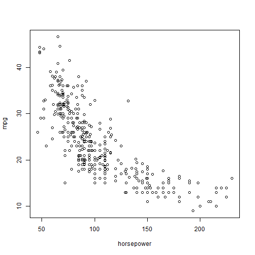

Leave-One-Out Cross-Validation (LOOCV)
========================================================

```r
require(ISLR)
```

```
## Loading required package: ISLR
```

```r
require(boot)
```

```
## Loading required package: boot
```

```r
# ?cv.glm
plot(mpg ~ horsepower, data = Auto)
```

 

```r


## LOOCV
glm.fit = glm(mpg ~ horsepower, data = Auto)
cv.glm(Auto, glm.fit)$delta  #pretty slow (doesnt use formula (5.2) on page 180)
```

```
## [1] 24.23 24.23
```


The cv.glm() function produces a list with several components. The two
numbers in the delta vector contain the cross-validation results.


##Lets write a simple function to use formula (5.2)
loocv=function(fit){
  h=lm.influence(fit)$h
  mean((residuals(fit)/(1-h))^2)
}

## Now we try it out
loocv(glm.fit)


cv.error=rep(0,5)
degree=1:5
for(d in degree){
  glm.fit=glm(mpg~poly(horsepower,d), data=Auto)
  cv.error[d]=loocv(glm.fit)
}
plot(degree,cv.error,type="b")


## 10-fold CV

cv.error10=rep(0,5)
for(d in degree){
  glm.fit=glm(mpg~poly(horsepower,d), data=Auto)
  cv.error10[d]=cv.glm(Auto,glm.fit,K=10)$delta[1]
}
lines(degree,cv.error10,type="b",col="red")


## Bootstrap
## Minimum risk investment - Section 5.2

alpha=function(x,y){
  vx=var(x)
  vy=var(y)
  cxy=cov(x,y)
  (vy-cxy)/(vx+vy-2*cxy)
}
alpha(Portfolio$X,Portfolio$Y)

## What is the standard error of alpha?

alpha.fn=function(data, index){
  with(data[index,],alpha(X,Y))
}

alpha.fn(Portfolio,1:100)

set.seed(1)
alpha.fn (Portfolio,sample(1:100,100,replace=TRUE))

boot.out=boot(Portfolio,alpha.fn,R=1000)
boot.out
plot(boot.out)
