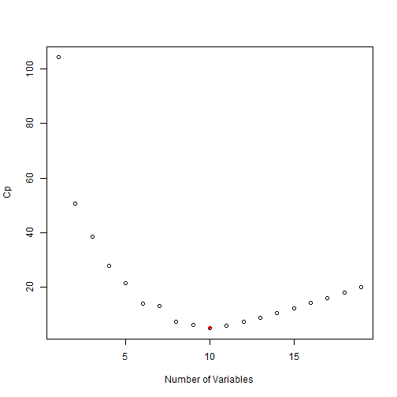
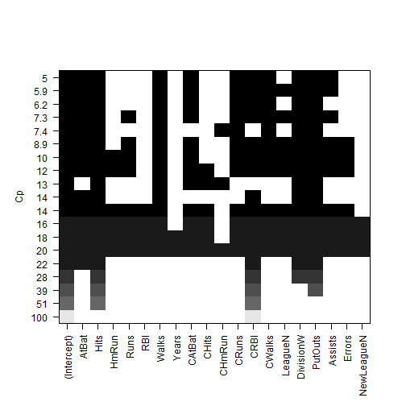
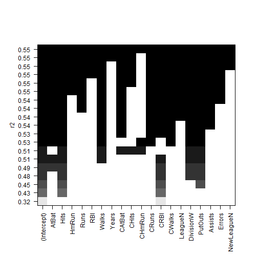
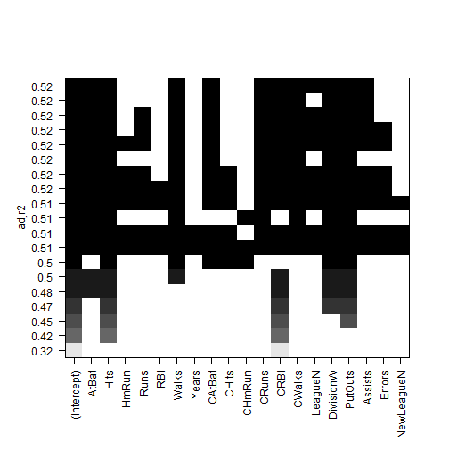
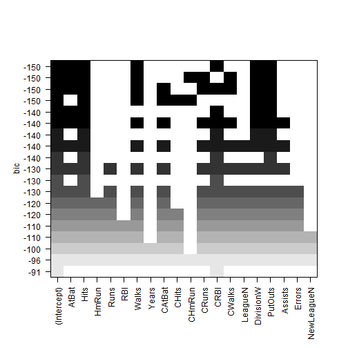
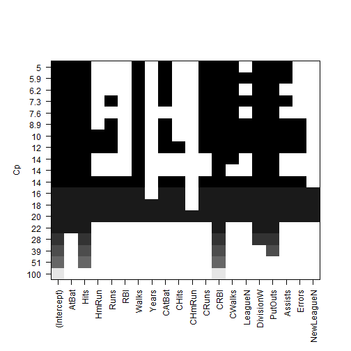
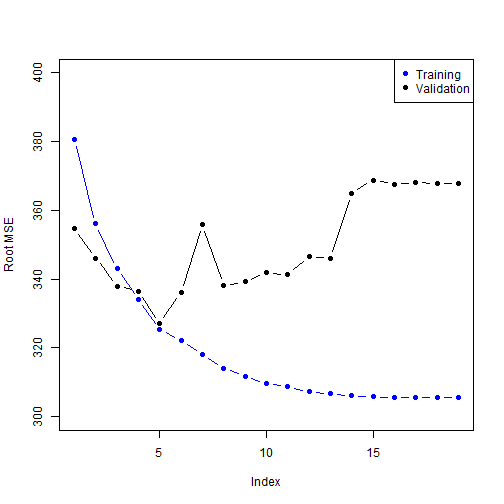
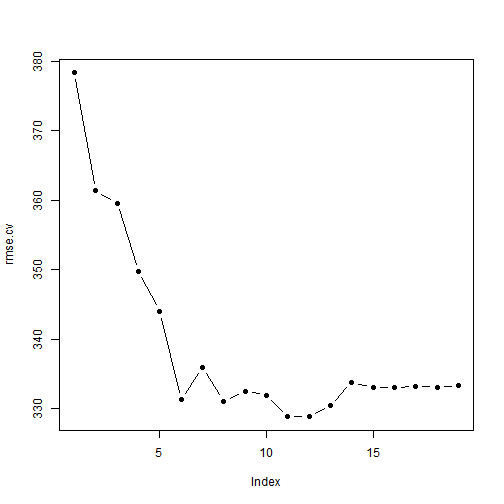

Model Selection
================


```r
library(ISLR)
```

```
## Warning: package 'ISLR' was built under R version 3.0.3
```

```r
summary(Hitters)
```

```
##      AtBat          Hits         HmRun           Runs      
##  Min.   : 16   Min.   :  1   Min.   : 0.0   Min.   :  0.0  
##  1st Qu.:255   1st Qu.: 64   1st Qu.: 4.0   1st Qu.: 30.2  
##  Median :380   Median : 96   Median : 8.0   Median : 48.0  
##  Mean   :381   Mean   :101   Mean   :10.8   Mean   : 50.9  
##  3rd Qu.:512   3rd Qu.:137   3rd Qu.:16.0   3rd Qu.: 69.0  
##  Max.   :687   Max.   :238   Max.   :40.0   Max.   :130.0  
##                                                            
##       RBI            Walks           Years           CAtBat     
##  Min.   :  0.0   Min.   :  0.0   Min.   : 1.00   Min.   :   19  
##  1st Qu.: 28.0   1st Qu.: 22.0   1st Qu.: 4.00   1st Qu.:  817  
##  Median : 44.0   Median : 35.0   Median : 6.00   Median : 1928  
##  Mean   : 48.0   Mean   : 38.7   Mean   : 7.44   Mean   : 2649  
##  3rd Qu.: 64.8   3rd Qu.: 53.0   3rd Qu.:11.00   3rd Qu.: 3924  
##  Max.   :121.0   Max.   :105.0   Max.   :24.00   Max.   :14053  
##                                                                 
##      CHits          CHmRun          CRuns           CRBI       
##  Min.   :   4   Min.   :  0.0   Min.   :   1   Min.   :   0.0  
##  1st Qu.: 209   1st Qu.: 14.0   1st Qu.: 100   1st Qu.:  88.8  
##  Median : 508   Median : 37.5   Median : 247   Median : 220.5  
##  Mean   : 718   Mean   : 69.5   Mean   : 359   Mean   : 330.1  
##  3rd Qu.:1059   3rd Qu.: 90.0   3rd Qu.: 526   3rd Qu.: 426.2  
##  Max.   :4256   Max.   :548.0   Max.   :2165   Max.   :1659.0  
##                                                                
##      CWalks       League  Division    PutOuts        Assists     
##  Min.   :   0.0   A:175   E:157    Min.   :   0   Min.   :  0.0  
##  1st Qu.:  67.2   N:147   W:165    1st Qu.: 109   1st Qu.:  7.0  
##  Median : 170.5                    Median : 212   Median : 39.5  
##  Mean   : 260.2                    Mean   : 289   Mean   :106.9  
##  3rd Qu.: 339.2                    3rd Qu.: 325   3rd Qu.:166.0  
##  Max.   :1566.0                    Max.   :1378   Max.   :492.0  
##                                                                  
##      Errors          Salary       NewLeague
##  Min.   : 0.00   Min.   :  67.5   A:176    
##  1st Qu.: 3.00   1st Qu.: 190.0   N:146    
##  Median : 6.00   Median : 425.0            
##  Mean   : 8.04   Mean   : 535.9            
##  3rd Qu.:11.00   3rd Qu.: 750.0            
##  Max.   :32.00   Max.   :2460.0            
##                  NA's   :59
```

There are some missing values here, so before we proceed we will remove them:


```r
Hitters = na.omit(Hitters)
with(Hitters, sum(is.na(Salary)))
```

```
## [1] 0
```


Best Subset regression
------------------------
We will now use the package `leaps` to evaluate all the best-subset models.

 To perform *best subset selection*, we fit a separate least squares regression for each possible combination of the p predictors.
 Here best is defined as having the smallest RSS, or equivalently largest R^2.
Select a single best model from among M0, . . . ,Mp using crossvalidated
prediction error, Cp (AIC), BIC, or adjusted R^2.

The problem is that a low RSS or a high R^2 indicates a model with a low training error,
whereas we wish to choose a model that has a low *test error*.

Therefore, we use cross-validated prediction

For instance, this output indicates that the best two-variable model contains only Hits and CRBI.

```r
library(leaps)
regfit.full = regsubsets(Salary ~ ., data = Hitters)
summary(regfit.full)
```

```
## Subset selection object
## Call: regsubsets.formula(Salary ~ ., data = Hitters)
## 19 Variables  (and intercept)
##            Forced in Forced out
## AtBat          FALSE      FALSE
## Hits           FALSE      FALSE
## HmRun          FALSE      FALSE
## Runs           FALSE      FALSE
## RBI            FALSE      FALSE
## Walks          FALSE      FALSE
## Years          FALSE      FALSE
## CAtBat         FALSE      FALSE
## CHits          FALSE      FALSE
## CHmRun         FALSE      FALSE
## CRuns          FALSE      FALSE
## CRBI           FALSE      FALSE
## CWalks         FALSE      FALSE
## LeagueN        FALSE      FALSE
## DivisionW      FALSE      FALSE
## PutOuts        FALSE      FALSE
## Assists        FALSE      FALSE
## Errors         FALSE      FALSE
## NewLeagueN     FALSE      FALSE
## 1 subsets of each size up to 8
## Selection Algorithm: exhaustive
##          AtBat Hits HmRun Runs RBI Walks Years CAtBat CHits CHmRun CRuns
## 1  ( 1 ) " "   " "  " "   " "  " " " "   " "   " "    " "   " "    " "  
## 2  ( 1 ) " "   "*"  " "   " "  " " " "   " "   " "    " "   " "    " "  
## 3  ( 1 ) " "   "*"  " "   " "  " " " "   " "   " "    " "   " "    " "  
## 4  ( 1 ) " "   "*"  " "   " "  " " " "   " "   " "    " "   " "    " "  
## 5  ( 1 ) "*"   "*"  " "   " "  " " " "   " "   " "    " "   " "    " "  
## 6  ( 1 ) "*"   "*"  " "   " "  " " "*"   " "   " "    " "   " "    " "  
## 7  ( 1 ) " "   "*"  " "   " "  " " "*"   " "   "*"    "*"   "*"    " "  
## 8  ( 1 ) "*"   "*"  " "   " "  " " "*"   " "   " "    " "   "*"    "*"  
##          CRBI CWalks LeagueN DivisionW PutOuts Assists Errors NewLeagueN
## 1  ( 1 ) "*"  " "    " "     " "       " "     " "     " "    " "       
## 2  ( 1 ) "*"  " "    " "     " "       " "     " "     " "    " "       
## 3  ( 1 ) "*"  " "    " "     " "       "*"     " "     " "    " "       
## 4  ( 1 ) "*"  " "    " "     "*"       "*"     " "     " "    " "       
## 5  ( 1 ) "*"  " "    " "     "*"       "*"     " "     " "    " "       
## 6  ( 1 ) "*"  " "    " "     "*"       "*"     " "     " "    " "       
## 7  ( 1 ) " "  " "    " "     "*"       "*"     " "     " "    " "       
## 8  ( 1 ) " "  "*"    " "     "*"       "*"     " "     " "    " "
```


It gives by default best-subsets up to size 8; lets increase that to 19, i.e. all the variables

```r
regfit.full = regsubsets(Salary ~ ., data = Hitters, nvmax = 19)
reg.summary = summary(regfit.full)
names(reg.summary)
```

```
## [1] "which"  "rsq"    "rss"    "adjr2"  "cp"     "bic"    "outmat" "obj"
```

```r
plot(reg.summary$cp, xlab = "Number of Variables", ylab = "Cp")
which.min(reg.summary$cp)
```

```
## [1] 10
```

```r
points(10, reg.summary$cp[10], pch = 20, col = "red")
```

 

There is a plot method for the `regsubsets`  object

```r
plot(regfit.full, scale = "Cp")
```

 

```r
coef(regfit.full, 10)
```

```
## (Intercept)       AtBat        Hits       Walks      CAtBat       CRuns 
##    162.5354     -2.1687      6.9180      5.7732     -0.1301      1.4082 
##        CRBI      CWalks   DivisionW     PutOuts     Assists 
##      0.7743     -0.8308   -112.3801      0.2974      0.2832
```

```r
plot(regfit.full, scale = "r2")
```

 

```r
plot(regfit.full, scale = "adjr2")
```

 

```r
plot(regfit.full, scale = "bic")
```

 

For instance, we see that several models share a BIC close to -150. However, the model with the lowest BIC is the six-variable model that contains only
*AtBat,Hits, Walks, CRBI,DivisionW, and PutOuts.*

Like **Cp**, the **BIC** will tend to take on a small value for a model with a low test error, and so generally we select the model that has the **lowest BIC value.**

BIC = 1/n*(RSS + log(n)d sigma^2)

Like **Cp**, the **BIC** will tend to take on a small value for a model with a low test error, and so generally we select the model that has the **lowest BIC value.**

For a least squares model with d variables, the adjusted R^2 statistic is calculated as

Adjusted R^2 = 1 - RSS/(n - d - 1)/TSS/(n - 1)

Unlike **Cp, AIC, and BIC,** for which a small value indicates a model with a low test error, a large value of adjusted **R^2** indicates a model with a small test error.


Forward Stepwise Selection
--------------------------
Forward stepwise selection begins with a model containing no predictors, and then adds predictors to the model, one-at-a-time, until all of the predictors are in the model.
In particular, at each step the variable that gives the greatest additional improvement to the fit is added to the model.

Unlike best subset selection, which involved fitting 2^p models, forward stepwise selection involves model 1+p(p+1)/2 models

Here we use the `regsubsets` function but specify the `method="forward"(*or method="backward"*) option:

```r
regfit.fwd = regsubsets(Salary ~ ., data = Hitters, nvmax = 19, method = "forward")
summary(regfit.fwd)
```

```
## Subset selection object
## Call: regsubsets.formula(Salary ~ ., data = Hitters, nvmax = 19, method = "forward")
## 19 Variables  (and intercept)
##            Forced in Forced out
## AtBat          FALSE      FALSE
## Hits           FALSE      FALSE
## HmRun          FALSE      FALSE
## Runs           FALSE      FALSE
## RBI            FALSE      FALSE
## Walks          FALSE      FALSE
## Years          FALSE      FALSE
## CAtBat         FALSE      FALSE
## CHits          FALSE      FALSE
## CHmRun         FALSE      FALSE
## CRuns          FALSE      FALSE
## CRBI           FALSE      FALSE
## CWalks         FALSE      FALSE
## LeagueN        FALSE      FALSE
## DivisionW      FALSE      FALSE
## PutOuts        FALSE      FALSE
## Assists        FALSE      FALSE
## Errors         FALSE      FALSE
## NewLeagueN     FALSE      FALSE
## 1 subsets of each size up to 19
## Selection Algorithm: forward
##           AtBat Hits HmRun Runs RBI Walks Years CAtBat CHits CHmRun CRuns
## 1  ( 1 )  " "   " "  " "   " "  " " " "   " "   " "    " "   " "    " "  
## 2  ( 1 )  " "   "*"  " "   " "  " " " "   " "   " "    " "   " "    " "  
## 3  ( 1 )  " "   "*"  " "   " "  " " " "   " "   " "    " "   " "    " "  
## 4  ( 1 )  " "   "*"  " "   " "  " " " "   " "   " "    " "   " "    " "  
## 5  ( 1 )  "*"   "*"  " "   " "  " " " "   " "   " "    " "   " "    " "  
## 6  ( 1 )  "*"   "*"  " "   " "  " " "*"   " "   " "    " "   " "    " "  
## 7  ( 1 )  "*"   "*"  " "   " "  " " "*"   " "   " "    " "   " "    " "  
## 8  ( 1 )  "*"   "*"  " "   " "  " " "*"   " "   " "    " "   " "    "*"  
## 9  ( 1 )  "*"   "*"  " "   " "  " " "*"   " "   "*"    " "   " "    "*"  
## 10  ( 1 ) "*"   "*"  " "   " "  " " "*"   " "   "*"    " "   " "    "*"  
## 11  ( 1 ) "*"   "*"  " "   " "  " " "*"   " "   "*"    " "   " "    "*"  
## 12  ( 1 ) "*"   "*"  " "   "*"  " " "*"   " "   "*"    " "   " "    "*"  
## 13  ( 1 ) "*"   "*"  " "   "*"  " " "*"   " "   "*"    " "   " "    "*"  
## 14  ( 1 ) "*"   "*"  "*"   "*"  " " "*"   " "   "*"    " "   " "    "*"  
## 15  ( 1 ) "*"   "*"  "*"   "*"  " " "*"   " "   "*"    "*"   " "    "*"  
## 16  ( 1 ) "*"   "*"  "*"   "*"  "*" "*"   " "   "*"    "*"   " "    "*"  
## 17  ( 1 ) "*"   "*"  "*"   "*"  "*" "*"   " "   "*"    "*"   " "    "*"  
## 18  ( 1 ) "*"   "*"  "*"   "*"  "*" "*"   "*"   "*"    "*"   " "    "*"  
## 19  ( 1 ) "*"   "*"  "*"   "*"  "*" "*"   "*"   "*"    "*"   "*"    "*"  
##           CRBI CWalks LeagueN DivisionW PutOuts Assists Errors NewLeagueN
## 1  ( 1 )  "*"  " "    " "     " "       " "     " "     " "    " "       
## 2  ( 1 )  "*"  " "    " "     " "       " "     " "     " "    " "       
## 3  ( 1 )  "*"  " "    " "     " "       "*"     " "     " "    " "       
## 4  ( 1 )  "*"  " "    " "     "*"       "*"     " "     " "    " "       
## 5  ( 1 )  "*"  " "    " "     "*"       "*"     " "     " "    " "       
## 6  ( 1 )  "*"  " "    " "     "*"       "*"     " "     " "    " "       
## 7  ( 1 )  "*"  "*"    " "     "*"       "*"     " "     " "    " "       
## 8  ( 1 )  "*"  "*"    " "     "*"       "*"     " "     " "    " "       
## 9  ( 1 )  "*"  "*"    " "     "*"       "*"     " "     " "    " "       
## 10  ( 1 ) "*"  "*"    " "     "*"       "*"     "*"     " "    " "       
## 11  ( 1 ) "*"  "*"    "*"     "*"       "*"     "*"     " "    " "       
## 12  ( 1 ) "*"  "*"    "*"     "*"       "*"     "*"     " "    " "       
## 13  ( 1 ) "*"  "*"    "*"     "*"       "*"     "*"     "*"    " "       
## 14  ( 1 ) "*"  "*"    "*"     "*"       "*"     "*"     "*"    " "       
## 15  ( 1 ) "*"  "*"    "*"     "*"       "*"     "*"     "*"    " "       
## 16  ( 1 ) "*"  "*"    "*"     "*"       "*"     "*"     "*"    " "       
## 17  ( 1 ) "*"  "*"    "*"     "*"       "*"     "*"     "*"    "*"       
## 18  ( 1 ) "*"  "*"    "*"     "*"       "*"     "*"     "*"    "*"       
## 19  ( 1 ) "*"  "*"    "*"     "*"       "*"     "*"     "*"    "*"
```

```r
plot(regfit.fwd, scale = "Cp")
```

 


Model Selection Using a Validation Set
---------------------------------------
**Therefore, the determination of which model of a given size is best must be made using only the training observations. This point is subtle but important.**

Lets make a training and validation set, so that we can choose a good subset model.
We will do it using a slightly different approach from what was done in the the book.

```r
dim(Hitters)
```

```
## [1] 263  20
```

```r
set.seed(1)
train = sample(seq(263), 180, replace = FALSE)
train
```

```
##   [1]  70  98 150 237  53 232 243 170 161  16 259  45 173  97 192 124 178
##  [18] 245  94 190 228  52 158  31  64  92   4  91 205  80 113 140 115  43
##  [35] 244 153 181  25 163  93 184 144 174 122 117 251   6 104 241 149 102
##  [52] 183 224 242  15  21  66 107 136  83 186  60 211  67 130 210  95 151
##  [69]  17 256 207 162 200 239 236 168 249  73 222 177 234 199 203  59 235
##  [86]  37 126  22 230 226  42  11 110 214 132 134  77  69 188 100 206  58
## [103]  44 159 101  34 208  75 185 201 261 112  54  65  23   2 106 254 257
## [120] 154 142  71 166 221 105  63 143  29 240 212 167 172   5  84 120 133
## [137]  72 191 248 138 182  74 179 135  87 196 157 119  13  99 263 125 247
## [154]  50  55  20  57   8  30 194 139 238  46  78  88  41   7  33 141  32
## [171] 180 164 213  36 215  79 225 229 198  76
```

```r
regfit.fwd = regsubsets(Salary ~ ., data = Hitters[train, ], nvmax = 19, method = "forward")
```

Now we will make predictions on the observations not used for training. We know there are 19 models, so we set up some vectors to record the errors. We have to do a bit of work here, because there is no predict method for `regsubsets`.

```r
val.errors = rep(NA, 19)
```


The *model.matrix()* function is used in many regression packages for building an *“X”* matrix from data. Now we run a loop, and for each size i, we extract the coefficients from
*regfit.best* for the best model of that size,multiply them into the appropriate columns of the test model matrix to form the predictions, and compute the test MSE.

```r
x.test = model.matrix(Salary ~ ., data = Hitters[-train, ])  # notice the -index!
# coefi=coef(regfit.fwd,id=1) coefi x.test[,names(coefi)]%*%coefi

for (i in 1:19) {
    coefi = coef(regfit.fwd, id = i)
    pred = x.test[, names(coefi)] %*% coefi
    val.errors[i] = mean((Hitters$Salary[-train] - pred)^2)
}
plot(sqrt(val.errors), ylab = "Root MSE", ylim = c(300, 400), pch = 19, type = "b")
points(sqrt(regfit.fwd$rss[-1]/180), col = "blue", pch = 19, type = "b")
legend("topright", legend = c("Training", "Validation"), col = c("blue", "black"), 
    pch = 19)
```

 


As we expect, the training error goes down monotonically as the model gets bigger, but not so
for the validation error.

This was a little tedious - not having a predict method for `regsubsets`. So we will write one!

```r
predict.regsubsets = function(object, newdata, id, ...) {
    form = as.formula(object$call[[2]])
    mat = model.matrix(form, newdata)
    coefi = coef(object, id = id)
    mat[, names(coefi)] %*% coefi
}

regfit.best = regsubsets(Salary ~ ., data = Hitters, nvmax = 19)
coef(regfit.best, 10)
```

```
## (Intercept)       AtBat        Hits       Walks      CAtBat       CRuns 
##    162.5354     -2.1687      6.9180      5.7732     -0.1301      1.4082 
##        CRBI      CWalks   DivisionW     PutOuts     Assists 
##      0.7743     -0.8308   -112.3801      0.2974      0.2832
```


Model Selection by Cross-Validation
-----------------------------------
We will do 10-fold cross-validation. Its really easy!

In the *k-th* fold, the elements of folds that equal *k* are in the test set, and the remainder are in the training set. We make our predictions for each model size (using our new predict() method), compute the test errors on the appropriate subset, and store them in the appropriate slot in the matrix cv.errors.

```r
set.seed(11)
folds = sample(rep(1:10, length = nrow(Hitters)))
folds
```

```
##   [1]  3  1  4  4  7  7  3  5  5  2  5  2  8  3  3  3  9  2  9  8 10  5  8
##  [24]  5  5  5  5 10 10  4  4  7  6  7  7  7  3  4  8  3  6  8 10  4  3  9
##  [47]  9  3  4  9  8  7 10  6 10  3  6  9  4  2  8  2  5  6 10  7  2  8  8
##  [70]  1  3  6  2  5  8  1  1  2  8  1 10  1  2  3  6  6  5  8  8 10  4  2
##  [93]  6  1  7  4  8  3  7  8  7  1 10  1  6  2  9 10  1  7  7  4  7  4 10
## [116]  3  6 10  6  6  9  8 10  6  7  9  6  7  1 10  2  2  5  9  9  6  1  1
## [139]  2  9  4 10  5  3  7  7 10 10  9  3  3  7  3  1  4  6  6 10  4  9  9
## [162]  1  3  6  8 10  8  5  4  5  6  2  9 10  3  7  7  6  6  2  3  2  4  4
## [185]  4  4  8  2  3  5  9  9 10  2  1  3  9  6  7  3  1  9  4 10 10  8  8
## [208]  8  2  5  9  8 10  5  8  2  4  1  4  4  5  5  2  1  9  5  2  9  9  5
## [231]  3  2  1  9  1  7  2  5  8  1  1  7  6  6  4  5 10  5  7  4  8  6  9
## [254]  1  2  5  7  1  3  1  3  1  2
```

```r
table(folds)
```

```
## folds
##  1  2  3  4  5  6  7  8  9 10 
## 27 27 27 26 26 26 26 26 26 26
```

```r
cv.errors = matrix(NA, 10, 19)
for (k in 1:10) {
    best.fit = regsubsets(Salary ~ ., data = Hitters[folds != k, ], nvmax = 19, 
        method = "forward")
    for (i in 1:19) {
        pred = predict(best.fit, Hitters[folds == k, ], id = i)
        cv.errors[k, i] = mean((Hitters$Salary[folds == k] - pred)^2)
    }
}
rmse.cv = sqrt(apply(cv.errors, 2, mean))
plot(rmse.cv, pch = 19, type = "b")
```

 


This has given us a 10x19 matrix, of which the *(i, k)th* element corresponds to the test *MSE* for the *ith* cross-validation fold for the best k-variable model.
We use the *apply()* function to average over the columns of this matrix in order to obtain a vector for which the *kth* element is the crossvalidation error for the *k-variable* model.


Ridge Regression and the Lasso
-------------------------------
*The subset selection methods use least squares to fit a linear model that contains a subset of the predictors.
*As an alternative, we can fit a model containing all p predictors using a technique that constrains or regularizes the coeficient estimates, or equivalently, that shrinks the coeficient estimates towards zero.
*It may not be immediately obvious why such a constraint should improve the fit, but it turns out that shrinking the coeficient estimates can significantly reduce their variance.
*We will use the package `glmnet`, which does not use the model formula language, so we will set up an `x` and `y`.

The *model.matrix()* function is particularly useful for creating x; not only does it produce a matrix corresponding to the 19 predictors but it also **automatically transforms any qualitative variables into dummy variables.**

```r
library(glmnet)
```

```
## Error: there is no package called 'glmnet'
```

```r
x = model.matrix(Salary ~ ., data = Hitters)[, -1]
Hitters = na.omit(Hitters)
y = Hitters$Salary
```

First we will fit a ridge-regression model. This is achieved by calling `glmnet` with `alpha=0` (see the helpfile). There is also a `cv.glmnet` function which will do the cross-validation for us.

```r
fit.ridge = glmnet(x, y, alpha = 0)
```

```
## Error: could not find function "glmnet"
```

```r
plot(fit.ridge, xvar = "lambda", label = TRUE)
```

```
## Error: object 'fit.ridge' not found
```

```r
cv.ridge = cv.glmnet(x, y, alpha = 0)
```

```
## Error: could not find function "cv.glmnet"
```

```r
plot(cv.ridge)
```

```
## Error: object 'cv.ridge' not found
```


Ridge regression does have one obvious disadvantage: unlike subset selection, which will generally select models that involve just a subset of the variables, **ridge regression will include all p predictors in the final model**

As with ridge regression, **the lasso shrinks the coeficient estimates towards zero.**

Now we fit a lasso model; for this we use the default `alpha=1`

```r
fit.lasso = glmnet(x, y)
```

```
## Error: could not find function "glmnet"
```

```r
plot(fit.lasso, xvar = "lambda", label = TRUE)
```

```
## Error: object 'fit.lasso' not found
```

```r
cv.lasso = cv.glmnet(x, y)
```

```
## Error: could not find function "cv.glmnet"
```

```r
plot(cv.lasso)
```

```
## Error: object 'cv.lasso' not found
```

```r
coef(cv.lasso)
```

```
## Error: object 'cv.lasso' not found
```


 Suppose we want to use our earlier train/validation division to select the `lambda` for the lasso.
 This is easy to do.

```r
set.seed(1)
train = sample(seq(263), 180, replace = FALSE)
lasso.tr = glmnet(x[train, ], y[train])
```

```
## Error: could not find function "glmnet"
```

```r
# lasso.tr
pred = predict(lasso.tr, x[-train, ])
```

```
## Error: object 'lasso.tr' not found
```

```r
dim(pred)
```

```
## [1] 26  1
```

```r
rmse = sqrt(apply((y[-train] - pred)^2, 2, mean))
```

```
## Warning: longer object length is not a multiple of shorter object length
```

```
## Error: dims [product 26] do not match the length of object [83]
```

```r
plot(log(lasso.tr$lambda), rmse, type = "b", xlab = "Log(lambda)")
```

```
## Error: object 'lasso.tr' not found
```

```r
lam.best = lasso.tr$lambda[order(rmse)[1]]
```

```
## Error: object 'lasso.tr' not found
```

```r
lam.best
```

```
## Error: object 'lam.best' not found
```

```r
coef(lasso.tr, s = lam.best)
```

```
## Error: object 'lasso.tr' not found
```


Principal Components Regression
-------------------------------

Setting **scale=TRUE** has the effect of standardizing each predictor, prior to generating the principal components, so that the scale on which each variable is measured will not have an effect.

**validation="CV"** causes pcr() to compute the ten-fold cross-validation error


```r
library(pls)
```

```
## Error: there is no package called 'pls'
```

```r
set.seed(2)
pcr.fit = pcr(Salary ~ ., data = Hitters, scale = TRUE, validation = "CV")
```

```
## Error: could not find function "pcr"
```

```r
summary(pcr.fit)
```

```
## Error: object 'pcr.fit' not found
```


For example,
setting M = 1 only captures 38.31% of all the variance, or information, in
the predictors. In contrast, using M = 6 increases the value to 88.63%.
 If we were to use all M = p = 19 components, this would increase to 100%.

```r
validationplot(pcr.fit, val.type = "MSEP")
```

```
## Error: could not find function "validationplot"
```


 We see that the smallest cross-validation error occurs when M = 16 components are used. This is barely fewer than M = 19, which amounts to simply performing least squares, because when all of the components are used in PCR no dimension reduction occurs.
 However, from the plot we also see that the cross-validation error is roughly the same when only one component is included in the model. This suggests that a model that uses just a small number of components might suffice.


```r
Hitters = na.omit(Hitters)
x = model.matrix(Salary ~ ., data = Hitters)[, -1]
y = Hitters$Salary
set.seed(2)
train = sample(seq(263), 180, replace = FALSE)
pcr.fit = pcr(Salary ~ ., data = Hitters[train, ], scale = TRUE, validation = "CV")
```

```
## Error: could not find function "pcr"
```

```r
validationplot(pcr.fit, val.type = "MSEP")
```

```
## Error: could not find function "validationplot"
```

```r

pcr.pred = predict(pcr.fit, x[-train, ], ncomp = 7)
```

```
## Error: object 'pcr.fit' not found
```

```r
mean((pcr.pred - y[-train])^2)
```

```
## Error: object 'pcr.pred' not found
```

This test set MSE is competitive with the results obtained using *ridge regression* and the *lasso*. However, as a result of the way PCR is implemented,the final model is more difficult to interpret because it does not perform any kind of variable selection or even directly produce coefficient estimates.


```r
pcr.fit = pcr(y ~ x, scale = TRUE, ncomp = 7)
```

```
## Error: could not find function "pcr"
```

```r
summary(pcr.fit)
```

```
## Error: object 'pcr.fit' not found
```


Partial Least Squares
-------------------------------


```r
set.seed(1)
train = sample(seq(263), 180, replace = FALSE)
Hitters = na.omit(Hitters)
x = model.matrix(Salary ~ ., data = Hitters)[, -1]
y = Hitters$Salary

pls.fit = plsr(Salary ~ ., data = Hitters, subset = train, scale = TRUE, validation = "CV")
```

```
## Error: could not find function "plsr"
```

```r
summary(pls.fit)
```

```
## Error: object 'pls.fit' not found
```

```r
validationplot(pls.fit, val.type = "MSEP")
```

```
## Error: could not find function "validationplot"
```


The lowest cross-validation error occurs when only M = 2 partial least squares directions are used. We now evaluate the corresponding test set MSE.


```r
pls.pred = predict(pls.fit, x[-train, ], ncomp = 2)
```

```
## Error: object 'pls.fit' not found
```

```r
mean((pls.pred - y[-train])^2)
```

```
## Error: object 'pls.pred' not found
```


The test MSE is comparable to, but slightly higher than, the test MSE obtained using ridge regression, the lasso, and PCR


```r
pls.fit = plsr(Salary ~ ., data = Hitters, scale = TRUE, ncomp = 2)
```

```
## Error: could not find function "plsr"
```

```r
summary(pls.fit)
```

```
## Error: object 'pls.fit' not found
```


Notice that the percentage of variance in Salary that the two-component PLS fit explains, 46.40%, is almost as much as that explained using the final seven-component model PCR fit, 46.69 %. This is because PCR only attempts to maximize the amount of variance explained in the predictors, while PLS searches for directions that explain variance in both the predictors and the response.

