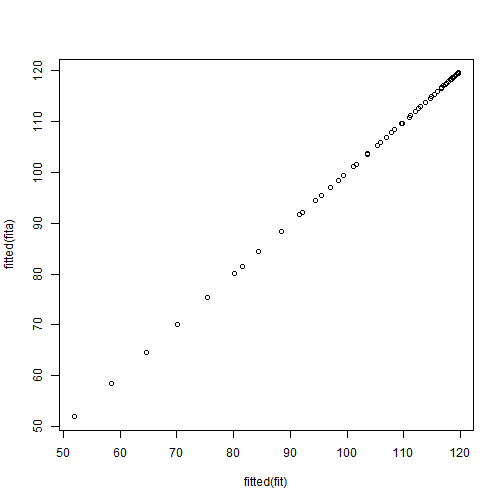
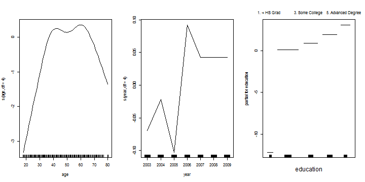
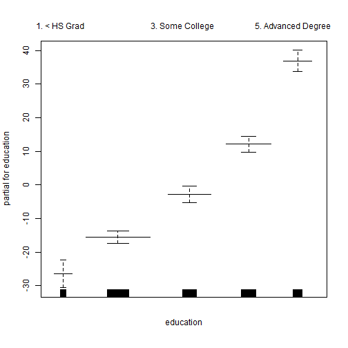

Nonlinear Models
========================================================
Here we explore the use of nonlinear models using some tools in R


```r
require(ISLR)
```

```
## Loading required package: ISLR
```

```
## Warning: package 'ISLR' was built under R version 3.0.3
```

```r
attach(Wage)
```


Polynomials
------------

First we will use polynomials, and focus on a single predictor age:


```r
fit = lm(wage ~ poly(age, 4), data = Wage)
summary(fit)
```

```
## 
## Call:
## lm(formula = wage ~ poly(age, 4), data = Wage)
## 
## Residuals:
##    Min     1Q Median     3Q    Max 
## -98.71 -24.63  -4.99  15.22 203.69 
## 
## Coefficients:
##               Estimate Std. Error t value Pr(>|t|)    
## (Intercept)    111.704      0.729  153.28   <2e-16 ***
## poly(age, 4)1  447.068     39.915   11.20   <2e-16 ***
## poly(age, 4)2 -478.316     39.915  -11.98   <2e-16 ***
## poly(age, 4)3  125.522     39.915    3.14   0.0017 ** 
## poly(age, 4)4  -77.911     39.915   -1.95   0.0510 .  
## ---
## Signif. codes:  0 '***' 0.001 '**' 0.01 '*' 0.05 '.' 0.1 ' ' 1
## 
## Residual standard error: 39.9 on 2995 degrees of freedom
## Multiple R-squared:  0.0863,	Adjusted R-squared:  0.085 
## F-statistic: 70.7 on 4 and 2995 DF,  p-value: <2e-16
```

```r
coef(fit)
```

```
##   (Intercept) poly(age, 4)1 poly(age, 4)2 poly(age, 4)3 poly(age, 4)4 
##        111.70        447.07       -478.32        125.52        -77.91
```


The `poly()` function generates a basis of *orthogonal polynomials*.
Lets make a plot of the fitted function, along with the standard errors of the fit.


```r
agelims = range(age)
age.grid = seq(from = agelims[1], to = agelims[2])
preds = predict(fit, newdata = list(age = age.grid), se = TRUE)
se.bands = cbind(preds$fit + 2 * preds$se, preds$fit - 2 * preds$se)
plot(age, wage, col = "darkgrey")
lines(age.grid, preds$fit, lwd = 2, col = "blue")
matlines(age.grid, se.bands, col = "blue", lty = 2)
```

 


Since f(x0) is a linear function of the betta, can get a simple expression for *pointwise-variances* Var[f(x0)] at any value x0. In the figure we have computed the fit and pointwise standard errors on a grid of values for x0. We show
f(x0) = +- 2*se[f(x0)]

There are other more direct ways of doing this in R. For example


```r
fita = lm(wage ~ age + I(age^2) + I(age^3) + I(age^4), data = Wage)
summary(fita)
```

```
## 
## Call:
## lm(formula = wage ~ age + I(age^2) + I(age^3) + I(age^4), data = Wage)
## 
## Residuals:
##    Min     1Q Median     3Q    Max 
## -98.71 -24.63  -4.99  15.22 203.69 
## 
## Coefficients:
##              Estimate Std. Error t value Pr(>|t|)    
## (Intercept) -1.84e+02   6.00e+01   -3.07  0.00218 ** 
## age          2.12e+01   5.89e+00    3.61  0.00031 ***
## I(age^2)    -5.64e-01   2.06e-01   -2.74  0.00626 ** 
## I(age^3)     6.81e-03   3.07e-03    2.22  0.02640 *  
## I(age^4)    -3.20e-05   1.64e-05   -1.95  0.05104 .  
## ---
## Signif. codes:  0 '***' 0.001 '**' 0.01 '*' 0.05 '.' 0.1 ' ' 1
## 
## Residual standard error: 39.9 on 2995 degrees of freedom
## Multiple R-squared:  0.0863,	Adjusted R-squared:  0.085 
## F-statistic: 70.7 on 4 and 2995 DF,  p-value: <2e-16
```

```r
coef(fita)
```

```
## (Intercept)         age    I(age^2)    I(age^3)    I(age^4) 
##  -1.842e+02   2.125e+01  -5.639e-01   6.811e-03  -3.204e-05
```


Here `I()` is a *wrapper* function; we need it because *age^2* means something to the formula language,
while `I(age^2)` is protected.
The coefficients are different to those we got before! However, the fits are the same:


```r
plot(fitted(fit), fitted(fita))
```

 


By using orthogonal polynomials in this simple way, it turns out that we can separately test
for each coefficient. So if we look at the summary again, we can see that the linear, quadratic
and cubic terms are significant, but not the quartic.


```r
summary(fit)
```

```
## 
## Call:
## lm(formula = wage ~ poly(age, 4), data = Wage)
## 
## Residuals:
##    Min     1Q Median     3Q    Max 
## -98.71 -24.63  -4.99  15.22 203.69 
## 
## Coefficients:
##               Estimate Std. Error t value Pr(>|t|)    
## (Intercept)    111.704      0.729  153.28   <2e-16 ***
## poly(age, 4)1  447.068     39.915   11.20   <2e-16 ***
## poly(age, 4)2 -478.316     39.915  -11.98   <2e-16 ***
## poly(age, 4)3  125.522     39.915    3.14   0.0017 ** 
## poly(age, 4)4  -77.911     39.915   -1.95   0.0510 .  
## ---
## Signif. codes:  0 '***' 0.001 '**' 0.01 '*' 0.05 '.' 0.1 ' ' 1
## 
## Residual standard error: 39.9 on 2995 degrees of freedom
## Multiple R-squared:  0.0863,	Adjusted R-squared:  0.085 
## F-statistic: 70.7 on 4 and 2995 DF,  p-value: <2e-16
```


This only works with linear regression, and if there is a single predictor. In general we would use **anova()** as this next example demonstrates.

In performing a polynomial regression we must decide on the degree of the polynomial to use.

 We use the **anova()** function, which performs an **anova()** analysis of variance (ANOVA, using an F-test) in order to test the null hypothesis that a model **M1** is sufficient to explain the data against the alternative hypothesis that a more complex model **M2** is required.
 In order to use the anova() function, **M1** and **M2** must be nested models: the predictors in **M1** must be a subset of the predictors in M2.
 In this case, we fit five different models and sequentially compare the simpler model to the more complex model.

```r
fita = lm(wage ~ education, data = Wage)
fitb = lm(wage ~ education + age, data = Wage)
fitc = lm(wage ~ education + poly(age, 2), data = Wage)
fitd = lm(wage ~ education + poly(age, 3), data = Wage)
anova(fita, fitb, fitc, fitd)
```

```
## Analysis of Variance Table
## 
## Model 1: wage ~ education
## Model 2: wage ~ education + age
## Model 3: wage ~ education + poly(age, 2)
## Model 4: wage ~ education + poly(age, 3)
##   Res.Df     RSS Df Sum of Sq      F Pr(>F)    
## 1   2995 3995721                               
## 2   2994 3867992  1    127729 102.74 <2e-16 ***
## 3   2993 3725395  1    142597 114.70 <2e-16 ***
## 4   2992 3719809  1      5587   4.49  0.034 *  
## ---
## Signif. codes:  0 '***' 0.001 '**' 0.01 '*' 0.05 '.' 0.1 ' ' 1
```

 The p-value comparing the linear **Model 1** to the quadratic **Model 2** is essentially zero (<10-15), indicating that a linear fit is not sufficient.
 Similarly the p-value comparing the quadratic **Model 2** to the cubic **Model 3**
is very low (0.0017), so the quadratic fit is also insufficient.
 The p-value comparing the cubic and degree-4 polynomials, **Model 3** and **Model 4**, is approximately 5% while the degree-5 polynomial **Model 5** seems unnecessary
because its p-value is 0.37.
 Hence, either a cubic or a quartic polynomial appear to provide a reasonable fit to the data, but lower- or higher-order models are not justified.


### Polynomial logistic regression

Now we fit a logistic regression model to a binary response variable,
constructed from `wage`. We code the big earners (`>250K`) as 1, else 0.


```r
fit = glm(I(wage > 250) ~ poly(age, 3), data = Wage, family = binomial)
summary(fit)
```

```
## 
## Call:
## glm(formula = I(wage > 250) ~ poly(age, 3), family = binomial, 
##     data = Wage)
## 
## Deviance Residuals: 
##    Min      1Q  Median      3Q     Max  
## -0.281  -0.274  -0.249  -0.176   3.287  
## 
## Coefficients:
##               Estimate Std. Error z value Pr(>|z|)    
## (Intercept)      -3.85       0.16  -24.10  < 2e-16 ***
## poly(age, 3)1    37.88      11.48    3.30  0.00097 ***
## poly(age, 3)2   -29.51      10.56   -2.79  0.00520 ** 
## poly(age, 3)3     9.80       9.00    1.09  0.27632    
## ---
## Signif. codes:  0 '***' 0.001 '**' 0.01 '*' 0.05 '.' 0.1 ' ' 1
## 
## (Dispersion parameter for binomial family taken to be 1)
## 
##     Null deviance: 730.53  on 2999  degrees of freedom
## Residual deviance: 707.92  on 2996  degrees of freedom
## AIC: 715.9
## 
## Number of Fisher Scoring iterations: 8
```

```r
preds = predict(fit, list(age = age.grid), se = T)
se.bands = preds$fit + cbind(fit = 0, lower = -2 * preds$se, upper = 2 * preds$se)
se.bands[1:5, ]
```

```
##      fit   lower  upper
## 1 -7.665 -10.760 -4.570
## 2 -7.325 -10.107 -4.543
## 3 -7.002  -9.493 -4.511
## 4 -6.695  -8.917 -4.473
## 5 -6.405  -8.379 -4.431
```


We have done the computations on the logit scale. To transform we need to apply the inverse logit
mapping
$$p=\frac{e^\eta}{1+e^\eta}.$$
(Here we have used the ability of MarkDown to interpret TeX expressions.)
We can do this simultaneously for all three columns of `se.bands`:


```r
prob.bands = exp(se.bands)/(1 + exp(se.bands))
matplot(age.grid, prob.bands, col = "blue", lwd = c(2, 1, 1), lty = c(1, 2, 
    2), type = "l", ylim = c(0, 0.1))
points(jitter(age), I(wage > 250)/10, pch = "|", cex = 0.5)
```

 

We have drawn the age values corresponding to the observations with wage values above 250 as gray marks on the top of the plot, and those with wage values below 250 are shown as gray marks on the bottom of the plot.


```r
table(cut(age, 4))
```

```
## 
## (17.9,33.5]   (33.5,49]   (49,64.5] (64.5,80.1] 
##         750        1399         779          72
```

```r
fit = lm(wage ~ cut(age, 4), data = Wage)
coef(summary(fit))
```

```
##                        Estimate Std. Error t value  Pr(>|t|)
## (Intercept)              94.158      1.476  63.790 0.000e+00
## cut(age, 4)(33.5,49]     24.053      1.829  13.148 1.982e-38
## cut(age, 4)(49,64.5]     23.665      2.068  11.443 1.041e-29
## cut(age, 4)(64.5,80.1]    7.641      4.987   1.532 1.256e-01
```

Here cut() automatically picked the cutpoints at 33.5, 49, and 64.5 years of age. We could also have specified our own cutpoints directly using the breaks option. The function cut() returns an ordered categorical variable; the lm() function then creates a set of dummy variables for use in the regression.

Splines
-------
 Splines are more flexible than polynomials, but the idea is rather similar.
Here we will explore cubic splines.
 A cubic spline with knots is a piecewise cubic polynomial with continuous derivatives up to order 2 at each knot.
 The **bs()** function generates the entire matrix of basis functions for splines with the specified set of knots. By default, cubic splines are produced.

```r
require(splines)
```

```
## Loading required package: splines
```

```r
fit = lm(wage ~ bs(age, knots = c(25, 40, 60)), data = Wage)
plot(age, wage, col = "darkgrey")
lines(age.grid, predict(fit, list(age = age.grid)), col = "darkgreen", lwd = 2)
abline(v = c(25, 40, 60), lty = 2, col = "darkgreen")

pred = predict(fit, newdata = list(age = age.grid), se = T)
lines(age.grid, pred$fit + 2 * pred$se, lty = "dashed")
lines(age.grid, pred$fit - 2 * pred$se, lty = "dashed")
```

 

 Here we have prespecified knots at ages 25, 40, and 60. This produces a spline with six basis functions. (Recall that a cubic spline with three knots has seven degrees of freedom; these degrees of freedom are used up by an intercept, plus six basis functions.)

 In order to instead fit a natural spline, we use the **ns()** function. Here we fit a natural spline with four degrees of freedom.


```r
plot(age, wage, col = "darkgrey")
fit2 = lm(wage ~ ns(age, df = 4), data = Wage)
pred2 = predict(fit2, newdata = list(age = age.grid), se = T)
lines(age.grid, pred2$fit, col = "red", lwd = 2)
```

 


 The smoothing splines does not require knot selection, but it does have a smoothing parameter,
which can conveniently be specified via the effective degrees of freedom or `df`.


```r
fit = smooth.spline(age, wage, df = 16)
lines(fit, col = "red", lwd = 2)
```

```
## Error: plot.new has not been called yet
```

```r
fit$df
```

```
## [1] 16
```


Or we can use LOO cross-validation to select the smoothing parameter for us automatically:


```r
fit = smooth.spline(age, wage, cv = TRUE)
```

```
## Warning: cross-validation with non-unique 'x' values seems doubtful
```

```r
lines(fit, col = "purple", lwd = 2)
```

```
## Error: plot.new has not been called yet
```

```r
fit$df
```

```
## [1] 6.795
```

```r
fit
```

```
## Call:
## smooth.spline(x = age, y = wage, cv = TRUE)
## 
## Smoothing Parameter  spar= 0.6989  lambda= 0.02792 (12 iterations)
## Equivalent Degrees of Freedom (Df): 6.795
## Penalized Criterion: 75216
## PRESS: 1593
```

 Notice that in the first call to **smooth.spline()**, we specified df=16. The function then determines which value of $lambda$ leads to 16 degrees of freedom.
 In the second call to smooth.spline(), we select the smoothness level by crossvalidation; this results in a value of $lambda$ that yields 6.8 degrees of freedom.

Local Regression
---------------------------


```r
plot(age, wage, xlim = agelims, cex = 0.5, col = " darkgrey ")
title(" Local Regression ")
fit = loess(wage ~ age, span = 0.2, data = Wage)
fit2 = loess(wage ~ age, span = 0.5, data = Wage)
lines(age.grid, predict(fit, data.frame(age = age.grid)), col = "red ", lwd = 2)
lines(age.grid, predict(fit2, data.frame(age = age.grid)), col = " blue", lwd = 2)
legend("topright", legend = c("Span =0.2", "Span =0.5"), col = c("red", "blue"), 
    lty = 1, lwd = 2, cex = 0.8)
```

 


 Here we have performed local linear regression using spans of 0.2 and 0.5: that is, each neighborhood consists of 20% or 50% of the observations.
 The larger the span, the smoother the fit. The locfit library can also be used
for fitting local regression models in R.

Generalized Additive Models
---------------------------

gam1=lm(wage~ns(year ,4)+ns(age ,5) +education ,data=Wage)

 So far we have focused on fitting models with mostly single nonlinear terms.
The `gam` package makes it easier to work with multiple nonlinear terms. In addition
it knows how to plot these functions and their standard errors.

 The **s()** function, which is part of the gam library, is used to indicate that we would like to use a ****smoothing spline****. We specify that the function of year should have 4 degrees of freedom, and that the function of age will have 5 degrees of freedom.
 

```r
require(gam)
```

```
## Loading required package: gam
```

```
## Warning: package 'gam' was built under R version 3.0.3
```

```
## Loaded gam 1.09
```

```r
gam1 = gam(wage ~ s(age, df = 4) + s(year, df = 4) + education, data = Wage)
par(mfrow = c(1, 3))
plot(gam1, se = T)
```

 

```r
gam2 = gam(I(wage > 250) ~ s(age, df = 4) + s(year, df = 4) + education, data = Wage, 
    family = binomial)
plot(gam2)
```

 

```r

plot(gam1, se = TRUE, col = "blue")
```

 

```r
plot.gam(gam1, se = TRUE, col = "red")
```

 


 In these plots, the function of year looks rather linear. We can perform a series of **ANOVA** tests in order to determine which of these three models is best: a GAM that excludes year (M1), a GAM that uses a linear function of year (M2), or a GAM that uses a spline function of year (M3).


```r
gam.m1 = gam(wage ~ s(age, 5) + education, data = Wage)
gam.m2 = gam(wage ~ year + s(age, 5) + education, data = Wage)
gam.m3 = gam(wage ~ s(year, 4) + s(age, 5) + education, data = Wage)
anova(gam.m1, gam.m2, gam.m3, test = "F")
```

```
## Analysis of Deviance Table
## 
## Model 1: wage ~ s(age, 5) + education
## Model 2: wage ~ year + s(age, 5) + education
## Model 3: wage ~ s(year, 4) + s(age, 5) + education
##   Resid. Df Resid. Dev Df Deviance    F  Pr(>F)    
## 1      2990    3711731                             
## 2      2989    3693842  1    17889 14.5 0.00014 ***
## 3      2986    3689770  3     4071  1.1 0.34857    
## ---
## Signif. codes:  0 '***' 0.001 '**' 0.01 '*' 0.05 '.' 0.1 ' ' 1
```

 We find that there is compelling evidence that a GAM with a linear function of year is better than a GAM that does not include year at all (p-value=0.00014). However, there is no evidence that a non-linear function
of year is needed (p-value=0.349). In other words, based on the results of this ANOVA, M2 is preferred.

 We can also use local regression fits as building blocks in a GAM, using the lo() function.


```r
gam.lo = gam(wage ~ s(year, df = 4) + lo(age, span = 0.7) + education, data = Wage)
plot.gam(gam.lo, se = TRUE, col = "green ")
```

   


Here we have used local regression for the age term, with a span of 0.7.
 We can also use the lo() function to create interactions before calling the gam() function.
For example Lets see if we need a nonlinear terms for year:


```r
gam.lo.i = gam(wage ~ lo(year, age, span = 0.5) + education, data = Wage)
library(akima)
```

```
## Error: there is no package called 'akima'
```

```r
plot(gam.lo.i)
```

```
## Loading required package: akima
```

```
## Warning: there is no package called 'akima'
```

```
## Error: You need to install and load the package 'akima' from the R
## contributed libraries
```


In order to fit a logistic regression GAM, we once again use the I() function in constructing the binary response variable, and set family=binomial.


```r
gam.lr = gam(I(wage > 250) ~ year + s(age, df = 5) + education, family = binomial, 
    data = Wage)
par(mfrow = c(1, 3))
plot(gam.lr, se = T, col = "green")
```

 

It is easy to see that there are no high earners in the <HS category:

```r
table(education, I(wage > 250))
```

```
##                     
## education            FALSE TRUE
##   1. < HS Grad         268    0
##   2. HS Grad           966    5
##   3. Some College      643    7
##   4. College Grad      663   22
##   5. Advanced Degree   381   45
```


Hence, we fit a logistic regression GAM using all but this category. This
provides more sensible results.

```r
gam.lr.s = gam(I(wage > 250) ~ year + s(age, df = 5) + education, family = binomial, 
    data = Wage, subset = (education != "1. < HS Grad"))
plot(gam.lr.s, se = T, col = "green")
```

   


```r
gam2a = gam(I(wage > 250) ~ s(age, df = 4) + year + education, data = Wage, 
    family = binomial)
anova(gam2a, gam2, test = "Chisq")
```

```
## Analysis of Deviance Table
## 
## Model 1: I(wage > 250) ~ s(age, df = 4) + year + education
## Model 2: I(wage > 250) ~ s(age, df = 4) + s(year, df = 4) + education
##   Resid. Df Resid. Dev Df Deviance Pr(>Chi)
## 1      2990        604                     
## 2      2987        603  3    0.905     0.82
```


One nice feature of the `gam` package is that it knows how to plot the functions nicely,
even for models fit by `lm` and `glm`.


```r
par(mfrow = c(1, 3))
lm1 = lm(wage ~ ns(age, df = 4) + ns(year, df = 4) + education, data = Wage)
plot.gam(lm1, se = T)
```

 

