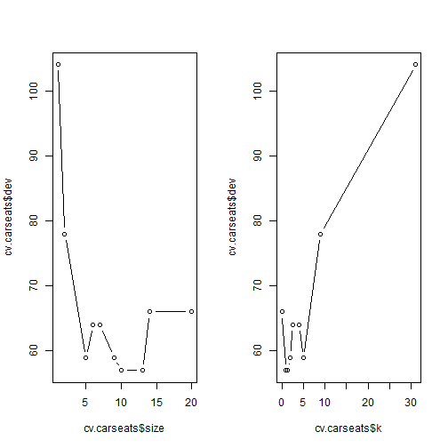

Decision Trees
========================================================

We will have a look at the `Carseats` data using the `tree` package in R, as in the lab in the book.
We create a binary response variable `High` (for high sales), and we include it in the same dataframe.

```r
require(ISLR)
```

```
## Loading required package: ISLR
```

```
## Warning: package 'ISLR' was built under R version 3.0.3
```

```r
require(tree)
```

```
## Loading required package: tree
```

```
## Warning: package 'tree' was built under R version 3.0.3
```

```r
attach(Carseats)
hist(Sales)
```

 

```r
High = ifelse(Sales <= 8, "No", "Yes")
Carseats = data.frame(Carseats, High)
```

Now we fit a tree to these data, and summarize and plot it. Notice that we have to _exclude_ `Sales` from the right-hand side of the formula, because the response is derived from it.

```r
tree.carseats = tree(High ~ . - Sales, data = Carseats)
summary(tree.carseats)
```

```
## 
## Classification tree:
## tree(formula = High ~ . - Sales, data = Carseats)
## Variables actually used in tree construction:
## [1] "ShelveLoc"   "Price"       "Income"      "CompPrice"   "Population" 
## [6] "Advertising" "Age"         "US"         
## Number of terminal nodes:  27 
## Residual mean deviance:  0.458 = 171 / 373 
## Misclassification error rate: 0.09 = 36 / 400
```

```r
plot(tree.carseats)
text(tree.carseats, pretty = 0)
```

 


We see that the training error rate is 9 %.

For a detailed summary of the tree, print it:

```r
tree.carseats
```

```
## node), split, n, deviance, yval, (yprob)
##       * denotes terminal node
## 
##   1) root 400 500 No ( 0.59 0.41 )  
##     2) ShelveLoc: Bad,Medium 315 400 No ( 0.69 0.31 )  
##       4) Price < 92.5 46  60 Yes ( 0.30 0.70 )  
##         8) Income < 57 10  10 No ( 0.70 0.30 )  
##          16) CompPrice < 110.5 5   0 No ( 1.00 0.00 ) *
##          17) CompPrice > 110.5 5   7 Yes ( 0.40 0.60 ) *
##         9) Income > 57 36  40 Yes ( 0.19 0.81 )  
##          18) Population < 207.5 16  20 Yes ( 0.38 0.62 ) *
##          19) Population > 207.5 20   8 Yes ( 0.05 0.95 ) *
##       5) Price > 92.5 269 300 No ( 0.75 0.25 )  
##        10) Advertising < 13.5 224 200 No ( 0.82 0.18 )  
##          20) CompPrice < 124.5 96  40 No ( 0.94 0.06 )  
##            40) Price < 106.5 38  30 No ( 0.84 0.16 )  
##              80) Population < 177 12  20 No ( 0.58 0.42 )  
##               160) Income < 60.5 6   0 No ( 1.00 0.00 ) *
##               161) Income > 60.5 6   5 Yes ( 0.17 0.83 ) *
##              81) Population > 177 26   8 No ( 0.96 0.04 ) *
##            41) Price > 106.5 58   0 No ( 1.00 0.00 ) *
##          21) CompPrice > 124.5 128 200 No ( 0.73 0.27 )  
##            42) Price < 122.5 51  70 Yes ( 0.49 0.51 )  
##              84) ShelveLoc: Bad 11   7 No ( 0.91 0.09 ) *
##              85) ShelveLoc: Medium 40  50 Yes ( 0.38 0.62 )  
##               170) Price < 109.5 16   7 Yes ( 0.06 0.94 ) *
##               171) Price > 109.5 24  30 No ( 0.58 0.42 )  
##                 342) Age < 49.5 13  20 Yes ( 0.31 0.69 ) *
##                 343) Age > 49.5 11   7 No ( 0.91 0.09 ) *
##            43) Price > 122.5 77  60 No ( 0.88 0.12 )  
##              86) CompPrice < 147.5 58  20 No ( 0.97 0.03 ) *
##              87) CompPrice > 147.5 19  30 No ( 0.63 0.37 )  
##               174) Price < 147 12  20 Yes ( 0.42 0.58 )  
##                 348) CompPrice < 152.5 7   6 Yes ( 0.14 0.86 ) *
##                 349) CompPrice > 152.5 5   5 No ( 0.80 0.20 ) *
##               175) Price > 147 7   0 No ( 1.00 0.00 ) *
##        11) Advertising > 13.5 45  60 Yes ( 0.44 0.56 )  
##          22) Age < 54.5 25  30 Yes ( 0.20 0.80 )  
##            44) CompPrice < 130.5 14  20 Yes ( 0.36 0.64 )  
##              88) Income < 100 9  10 No ( 0.56 0.44 ) *
##              89) Income > 100 5   0 Yes ( 0.00 1.00 ) *
##            45) CompPrice > 130.5 11   0 Yes ( 0.00 1.00 ) *
##          23) Age > 54.5 20  20 No ( 0.75 0.25 )  
##            46) CompPrice < 122.5 10   0 No ( 1.00 0.00 ) *
##            47) CompPrice > 122.5 10  10 No ( 0.50 0.50 )  
##              94) Price < 125 5   0 Yes ( 0.00 1.00 ) *
##              95) Price > 125 5   0 No ( 1.00 0.00 ) *
##     3) ShelveLoc: Good 85  90 Yes ( 0.22 0.78 )  
##       6) Price < 135 68  50 Yes ( 0.12 0.88 )  
##        12) US: No 17  20 Yes ( 0.35 0.65 )  
##          24) Price < 109 8   0 Yes ( 0.00 1.00 ) *
##          25) Price > 109 9  10 No ( 0.67 0.33 ) *
##        13) US: Yes 51  20 Yes ( 0.04 0.96 ) *
##       7) Price > 135 17  20 No ( 0.65 0.35 )  
##        14) Income < 46 6   0 No ( 1.00 0.00 ) *
##        15) Income > 46 11  20 Yes ( 0.45 0.55 ) *
```

Lets create a training and test set (250,150) split of the 400 observations, grow the tree on the training set, and evaluate its performance on the test set.

```r
set.seed(1011)
train = sample(1:nrow(Carseats), 250)
tree.carseats = tree(High ~ . - Sales, Carseats, subset = train)
plot(tree.carseats)
text(tree.carseats, pretty = 0)
```

 

```r
tree.pred = predict(tree.carseats, Carseats[-train, ], type = "class")
with(Carseats[-train, ], table(tree.pred, High))
```

```
##          High
## tree.pred No Yes
##       No  72  27
##       Yes 18  33
```

```r
(72 + 33)/150
```

```
## [1] 0.7
```

This tree was grown to full depth, and might be too variable. We now use CV to prune it.

The function cv.tree() performs cross-validation in order to determine the optimal level of tree complexity; cost complexity pruning is used in order to select a sequence of trees for consideration.


```r
cv.carseats = cv.tree(tree.carseats, FUN = prune.misclass)
cv.carseats
```

```
## $size
##  [1] 20 14 13 10  9  7  6  5  2  1
## 
## $dev
##  [1]  66  66  57  57  59  64  64  59  78 104
## 
## $k
##  [1]   -Inf  0.000  1.000  1.333  2.000  2.500  4.000  5.000  9.000 31.000
## 
## $method
## [1] "misclass"
## 
## attr(,"class")
## [1] "prune"         "tree.sequence"
```


Note that, despite the name, **dev** corresponds to the cross-validation error
rate in this instance. 
The tree with 9 terminal nodes results in the lowest cross-validation error rate, with 50 cross-validation errors.
We plot the error rate as a function of both size and k.
л - well as the corresponding error rate and the value of the cost-complexity parameter used

```r
par(mfrow = c(1, 2))
plot(cv.carseats$size, cv.carseats$dev, type = "b")
plot(cv.carseats$k, cv.carseats$dev, type = "b")
```

 


We now apply the **prune.misclass()** function in order to prune the tree to prune.
obtain the nine-node tree.

```r
plot(cv.carseats)
```

 

```r
prune.carseats = prune.misclass(tree.carseats, best = 13)
plot(prune.carseats)
text(prune.carseats, pretty = 0)
```

 

Now lets evaluate this pruned tree on the test data.

```r
tree.pred = predict(prune.carseats, Carseats[-train, ], type = "class")
with(Carseats[-train, ], table(tree.pred, High))
```

```
##          High
## tree.pred No Yes
##       No  72  28
##       Yes 18  32
```

```r
(72 + 32)/150
```

```
## [1] 0.6933
```

It has done about the same as our original tree. So pruning did not hurt us wrt misclassification errors, and gave us a simpler tree.

Fitting Regression Trees
------------------------

```r
library(MASS)
```

```
## Warning: package 'MASS' was built under R version 3.0.3
```

```r
set.seed(1)
train = sample(1:nrow(Boston), nrow(Boston)/2)
tree.boston = tree(medv ~ ., Boston, subset = train)
summary(tree.boston)
```

```
## 
## Regression tree:
## tree(formula = medv ~ ., data = Boston, subset = train)
## Variables actually used in tree construction:
## [1] "lstat" "rm"    "dis"  
## Number of terminal nodes:  8 
## Residual mean deviance:  12.6 = 3100 / 245 
## Distribution of residuals:
##    Min. 1st Qu.  Median    Mean 3rd Qu.    Max. 
## -14.100  -2.040  -0.054   0.000   1.960  12.600
```

Notice that the output of summary() indicates that only three of the variables
have been used in constructing the tree. In the context of a regression
tree, the deviance is simply the sum of squared errors for the tree. We now
plot the tree.

```r
plot(tree.boston)
text(tree.boston, pretty = 0)
```

 


Now we use the cv.tree() function to see whether pruning the tree will improve performance.


```r
cv.boston = cv.tree(tree.boston)
plot(cv.boston$size, cv.boston$dev, type = "b")
```

 


In this case, the most complex tree is selected by cross-validation. However,
if we wish to prune the tree, we could do so as follows, using the prune.tree() function


```r
prune.boston = prune.tree(tree.boston, best = 5)
plot(prune.boston)
text(prune.boston, pretty = 0)
```

 


In keeping with the cross-validation results, we use the unpruned tree to
make predictions on the test set.

```r
yhat = predict(tree.boston, newdata = Boston[-train, ])
boston.test = Boston[-train, "medv"]
plot(yhat, boston.test)
abline(0, 1)
```

 

```r
mean((yhat - boston.test)^2)
```

```
## [1] 25.05
```


Random Forests and Boosting
============================

These methods use trees as building blocks to build more complex models. Here we will use the Boston housing data to explore random forests and boosting. These data are in the `MASS` package.
It gives housing values and other statistics in each of 506 suburbs of Boston based on a 1970 census.

Random Forests
--------------
Random forests build lots of bushy trees, and then average them to reduce the variance.


```r
require(randomForest)
```

```
## Loading required package: randomForest
```

```
## Warning: package 'randomForest' was built under R version 3.0.3
```

```
## randomForest 4.6-7
## Type rfNews() to see new features/changes/bug fixes.
```

```r
require(MASS)
set.seed(101)
dim(Boston)
```

```
## [1] 506  14
```

```r
train = sample(1:nrow(Boston), 300)
`?`(Boston)
```

```
## starting httpd help server ... done
```

Lets fit a random forest and see how well it performs. We will use the response `medv`, the median housing value (in \$1K dollars)


```r
rf.boston = randomForest(medv ~ ., data = Boston, subset = train)
rf.boston
```

```
## 
## Call:
##  randomForest(formula = medv ~ ., data = Boston, subset = train) 
##                Type of random forest: regression
##                      Number of trees: 500
## No. of variables tried at each split: 4
## 
##           Mean of squared residuals: 12.25
##                     % Var explained: 85.2
```

```r
importance(rf.boston)
```

```
##         IncNodePurity
## crim           1435.6
## zn              120.4
## indus          1210.4
## chas            215.7
## nox            1581.6
## rm             7150.0
## age             655.9
## dis            1344.0
## rad             268.7
## tax             790.3
## ptratio        1988.2
## black           457.4
## lstat          7212.1
```

```r
varImpPlot(rf.boston)
```

 


 The results indicate that across all of the trees considered in the random
forest, the wealth level of the community (**lstat**) and the house size (**rm**)
are by far the two most important variables.

The MSR and % variance explained are based on OOB  or _out-of-bag_ estimates, a very clever device in random forests to get honest error estimates. The model reports that `mtry=4`, which is the number of variables randomly chosen at each split. Since $p=13$ here, we could try all 13 possible values of `mtry`. We will do so, record the results, and make a plot.


```r
oob.err = double(13)
test.err = double(13)
for (mtry in 1:13) {
    fit = randomForest(medv ~ ., data = Boston, subset = train, mtry = mtry, 
        ntree = 400)
    oob.err[mtry] = fit$mse[400]
    pred = predict(fit, Boston[-train, ])
    test.err[mtry] = with(Boston[-train, ], mean((medv - pred)^2))
    cat(mtry, " ")
}
```

```
## 1  2  3  4  5  6  7  8  9  10  11  12  13
```

```r
matplot(1:mtry, cbind(test.err, oob.err), pch = 19, col = c("red", "blue"), 
    type = "b", ylab = "Mean Squared Error")
legend("topright", legend = c("OOB", "Test"), pch = 19, col = c("red", "blue"))
```

 


Not too difficult! Although the test-error curve drops below the OOB curve, these are estimates based on data, and so have their own standard errors (which are typically quite large). Notice that the points at the end with `mtry=13` correspond to bagging.

Boosting
--------
Boosting builds lots of smaller trees. Unlike random forests, each new tree in boosting tries to patch up the deficiencies of the current ensemble.

We run `gbm()` with the option `distribution="gaussian"` since this is a regression problem; if it were a binary classification problem, we would use distribution="bernoulli". 
The argument `n.trees=10000` indicates that we want 10000 trees, and the option `interaction.depth=4` limits the depth of each tree.


```r
require(gbm)
```

```
## Loading required package: gbm
```

```
## Warning: package 'gbm' was built under R version 3.0.3
```

```
## Loading required package: survival
## Loading required package: splines
## Loading required package: lattice
## Loading required package: parallel
## Loaded gbm 2.1
```

```r
boost.boston = gbm(medv ~ ., data = Boston[train, ], distribution = "gaussian", 
    n.trees = 10000, shrinkage = 0.01, interaction.depth = 4)
summary(boost.boston)
```

 

```
##             var rel.inf
## lstat     lstat 34.6554
## rm           rm 32.3589
## dis         dis  8.0045
## crim       crim  5.5332
## nox         nox  4.8561
## ptratio ptratio  3.9799
## black     black  3.1906
## age         age  2.9212
## tax         tax  1.5449
## chas       chas  1.3990
## rad         rad  0.8647
## indus     indus  0.5844
## zn           zn  0.1072
```


 We see that 'lstat' and rm are by far the most important variables. We can
also produce partial dependence plots for these two variables.
 These plots illustrate the marginal effect of the selected variables on the response after integrating out the other variables. In this case, as we might expect, median house prices are increasing with rm and decreasing with lstat.


```r
plot(boost.boston, i = "lstat")
```

 

```r
plot(boost.boston, i = "rm")
```

 

Lets make a prediction on the test set. With boosting, the number of trees is a tuning parameter, and if we have too many we can overfit. So we should use cross-validation to select the number of trees. We will leave this as an exercise. Instead, we will compute the test error as a function of the number of trees, and make a plot.


```r
n.trees = seq(from = 100, to = 10000, by = 100)
predmat = predict(boost.boston, newdata = Boston[-train, ], n.trees = n.trees)
dim(predmat)
```

```
## [1] 206 100
```

```r
berr = with(Boston[-train, ], apply((predmat - medv)^2, 2, mean))
plot(n.trees, berr, pch = 19, ylab = "Mean Squared Error", xlab = "# Trees", 
    main = "Boosting Test Error")
abline(h = min(test.err), col = "red")
```

 


 
