SVM
========================================================
To demonstrate the SVM, it is easiest to work in low dimensions, so we can see the data.

Linear SVM classifier
---------------------
Lets generate some data in two dimensions, and make them a little separated.

```r
set.seed(10111)
x = matrix(rnorm(40), 20, 2)
y = rep(c(-1, 1), c(10, 10))
x[y == 1, ] = x[y == 1, ] + 1
plot(x, col = y + 3, pch = 19)
```

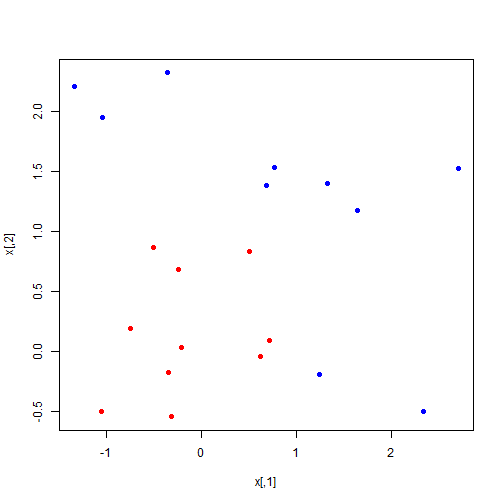 

Now we will load the package `e1071` which contains the `svm` function we will use. We then compute the fit. Notice that we have to specify a `cost` parameter, which is a tuning parameter.
support vector classifier when the argument **kernel="linear"** is used

 A **cost** argument allows us to specify the cost of a violation to the margin. When the **cost** argument is small, then the margins will be wide and many support vectors will be on the margin or will violate the margin. When the **cost** argument is large, then the margins will be narrow and there will be few support vectors on the margin or violating the margin.
 

```r
library(e1071)
```

```
## Warning: package 'e1071' was built under R version 3.0.3
```

```r
dat = data.frame(x, y = as.factor(y))
svmfit = svm(y ~ ., data = dat, kernel = "linear", cost = 10, scale = FALSE)
print(svmfit)
```

```
## 
## Call:
## svm(formula = y ~ ., data = dat, kernel = "linear", cost = 10, 
##     scale = FALSE)
## 
## 
## Parameters:
##    SVM-Type:  C-classification 
##  SVM-Kernel:  linear 
##        cost:  10 
##       gamma:  0.5 
## 
## Number of Support Vectors:  6
```

```r
plot(svmfit, dat)
```

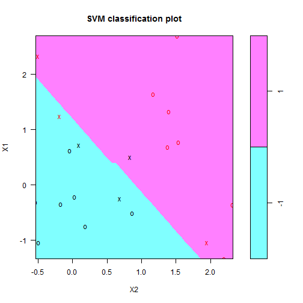 

 
 The region of feature space that will be assigned to the -1 class is shown in light blue, and the region that will be assigned to the +1 class is shown in purple. The decision boundary between the two classes is linear (because we used the argument kernel="linear"), though due to the way in which the plotting function is implemented in this library the decision boundary looks somewhat jagged in the plot.

As mentioned in the the chapter, the plot function is somewhat crude, and plots X2 on the horizontal axis (unlike what R would do automatically for a matrix). Lets see how we might make our own plot.

The first thing we will do is make a grid of values for X1 and X2. We will write a function to do that,
in case we want to reuse it. It uses the handy function `expand.grid`, and produces the coordinates of `n*n` points on a lattice covering the domain of `x`. Having made the lattice, we make a prediction at each point on the lattice. We then plot the lattice, color-coded according to the classification. Now we can see the decision boundary.

The support points (points on the margin, or on the wrong side of the margin) are indexed in the `$index` component of the fit.


```r
make.grid = function(x, n = 75) {
    grange = apply(x, 2, range)
    x1 = seq(from = grange[1, 1], to = grange[2, 1], length = n)
    x2 = seq(from = grange[1, 2], to = grange[2, 2], length = n)
    expand.grid(X1 = x1, X2 = x2)
}
xgrid = make.grid(x)
ygrid = predict(svmfit, xgrid)
plot(xgrid, col = c("red", "blue")[as.numeric(ygrid)], pch = 20, cex = 0.2)
points(x, col = y + 3, pch = 19)
points(x[svmfit$index, ], pch = 5, cex = 2)
```

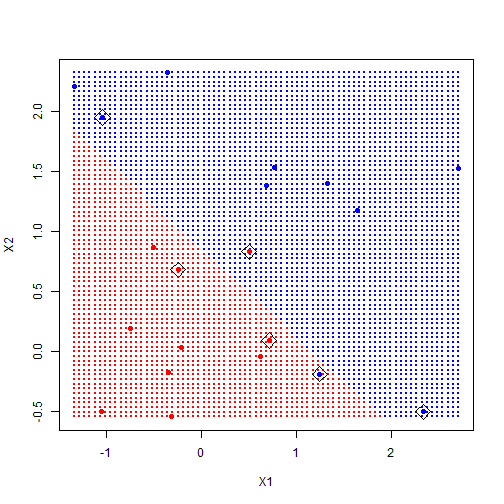 

 The `svm` function is not too friendly, in that we have to do some work to get back the linear coefficients, as described in the text. Probably the reason is that this only makes sense for linear kernels, and the function is more general. Here we will use a formula to extract the coefficients; for those interested in where this comes from, have a look in chapter 12 of ESL ("Elements of Statistical Learning").

 We extract the linear coefficients, and then using simple algebra, we include the decision boundary and the two margins.


```r
beta = drop(t(svmfit$coefs) %*% x[svmfit$index, ])
beta0 = svmfit$rho
plot(xgrid, col = c("red", "blue")[as.numeric(ygrid)], pch = 20, cex = 0.2)
points(x, col = y + 3, pch = 19)
points(x[svmfit$index, ], pch = 5, cex = 2)
abline(beta0/beta[2], -beta[1]/beta[2])
abline((beta0 - 1)/beta[2], -beta[1]/beta[2], lty = 2)
abline((beta0 + 1)/beta[2], -beta[1]/beta[2], lty = 2)
```

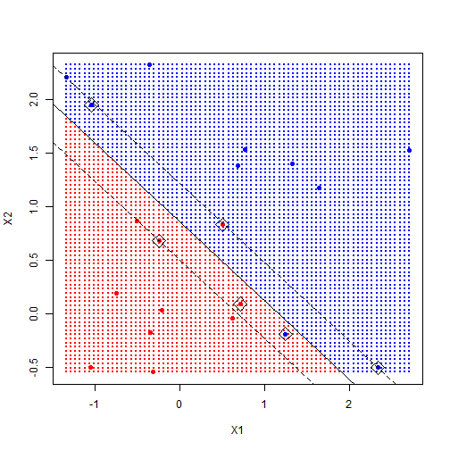 

 Just like for the other models in this book, the tuning parameter `C` has to be selected.
Different values will give different solutions. Rerun the code above, but using `C=1`, and see what we mean. One can use cross-validation to do this.

 The e1071 library includes a built-in function, tune(), to perform crosstune() validation. By default, tune() performs ten-fold cross-validation on a set of models of interest. In order to use this function, we pass in relevant information about the set of models that are under consideration. The following command indicates that we want to compare SVMs with a linear
kernel, using a range of values of the cost parameter.


```r
set.seed(10111)
x = matrix(rnorm(40), 20, 2)
y = rep(c(-1, 1), c(10, 10))
x[y == 1, ] = x[y == 1, ] + 1
dat = data.frame(x, y = as.factor(y))

set.seed(1)
tune.out = tune(svm, y ~ ., data = dat, kernel = "linear", ranges = list(cost = c(0.001, 
    0.01, 0.1, 1, 5, 10, 100)))
summary(tune.out)
```

```
## 
## Parameter tuning of 'svm':
## 
## - sampling method: 10-fold cross validation 
## 
## - best parameters:
##  cost
##   100
## 
## - best performance: 0.1 
## 
## - Detailed performance results:
##    cost error dispersion
## 1 1e-03  0.70     0.4216
## 2 1e-02  0.70     0.4216
## 3 1e-01  0.20     0.2582
## 4 1e+00  0.25     0.2635
## 5 5e+00  0.15     0.2415
## 6 1e+01  0.15     0.2415
## 7 1e+02  0.10     0.2108
```

 
 We see that cost=0.1 results in the lowest cross-validation error rate. The
tune() function stores the best model obtained, which can be accessed as follows:


```r
bestmod = tune.out$best.model
summary(bestmod)
```

```
## 
## Call:
## best.tune(method = svm, train.x = y ~ ., data = dat, ranges = list(cost = c(0.001, 
##     0.01, 0.1, 1, 5, 10, 100)), kernel = "linear")
## 
## 
## Parameters:
##    SVM-Type:  C-classification 
##  SVM-Kernel:  linear 
##        cost:  100 
##       gamma:  0.5 
## 
## Number of Support Vectors:  5
## 
##  ( 2 3 )
## 
## 
## Number of Classes:  2 
## 
## Levels: 
##  -1 1
```


  The predict() function can be used to predict the class label on a set of test observations, at any given value of the cost parameter. We begin by generating a test data set.
 

```r
xtest = matrix(rnorm(20 * 2), ncol = 2)
ytest = sample(c(-1, 1), 20, rep = TRUE)
xtest[ytest == 1, ] = xtest[ytest == 1, ] + 1
testdat = data.frame(x = xtest, y = as.factor(ytest))
names(testdat) <- c("X1", "X2", "y")
ypred = predict(bestmod, testdat)
table(predict = ypred, truth = testdat$y)
```

```
##        truth
## predict -1  1
##      -1 11  1
##      1   0  8
```


What if we had instead used cost=0.01?

```r
svmfit = svm(y ~ ., data = dat, kernel = "linear", cost = 0.01, scale = FALSE)
ypred = predict(svmfit, testdat)
table(predict = ypred, truth = testdat$y)
```

```
##        truth
## predict -1  1
##      -1 11  1
##      1   0  8
```

In this case one additional observation is misclassified

Now consider a situation in which the two classes are linearly separable.


```r
x[y == 1, ] = x[y == 1, ] + 0.5
plot(x, col = (y + 5)/2, pch = 19)
```

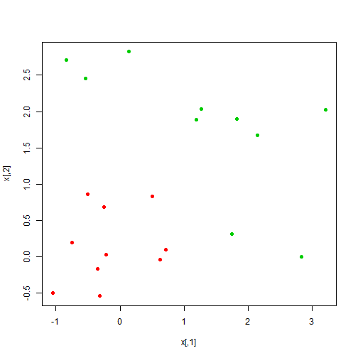 

```r

dat = data.frame(x = x, y = as.factor(y))
svmfit = svm(y ~ ., data = dat, kernel = "linear", cost = 1e+05)
summary(svmfit)
```

```
## 
## Call:
## svm(formula = y ~ ., data = dat, kernel = "linear", cost = 1e+05)
## 
## 
## Parameters:
##    SVM-Type:  C-classification 
##  SVM-Kernel:  linear 
##        cost:  1e+05 
##       gamma:  0.5 
## 
## Number of Support Vectors:  3
## 
##  ( 1 2 )
## 
## 
## Number of Classes:  2 
## 
## Levels: 
##  -1 1
```

```r
plot(svmfit, dat)
```

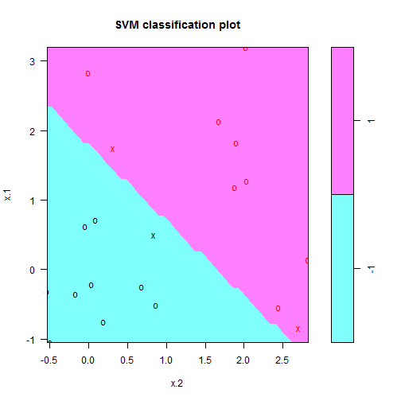 


We now try a smaller value of cost:

```r
svmfit = svm(y ~ ., data = dat, kernel = "linear", cost = 1)
summary(svmfit)
```

```
## 
## Call:
## svm(formula = y ~ ., data = dat, kernel = "linear", cost = 1)
## 
## 
## Parameters:
##    SVM-Type:  C-classification 
##  SVM-Kernel:  linear 
##        cost:  1 
##       gamma:  0.5 
## 
## Number of Support Vectors:  7
## 
##  ( 3 4 )
## 
## 
## Number of Classes:  2 
## 
## Levels: 
##  -1 1
```

```r
plot(svmfit, dat)
```

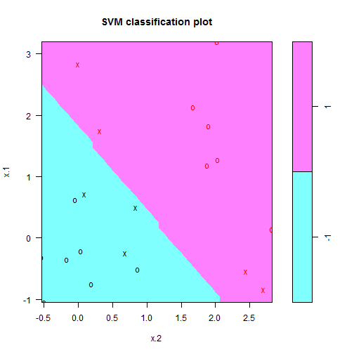 


 Using **cost=1**, we misclassify a training observation, but we also obtain
a much wider margin and make use of seven support vectors. It seems
likely that this model will perform better on test data than the model with
**cost=1e5**.

Nonlinear SVM
--------------
 To fit an SVM with a polynomial kernel we use **kernel="polynomial"**, and to fit an SVM with a radial kernel we use **kernel="radial"**.
 


```r
set.seed(1)
x = matrix(rnorm(200 * 2), ncol = 2)
x[1:100, ] = x[1:100, ] + 2
x[101:150, ] = x[101:150, ] - 2
y = c(rep(1, 150), rep(2, 50))
dat = data.frame(x = x, y = as.factor(y))
plot(x, col = y)
```

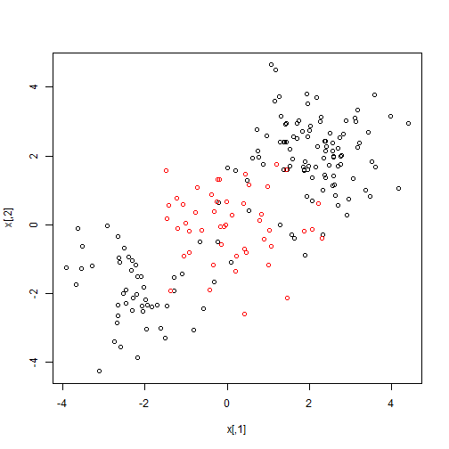 

```r

train = sample(200, 100)
svmfit = svm(y ~ ., data = dat[train, ], kernel = "radial", gamma = 1, cost = 1)
plot(svmfit, dat[train, ])
```

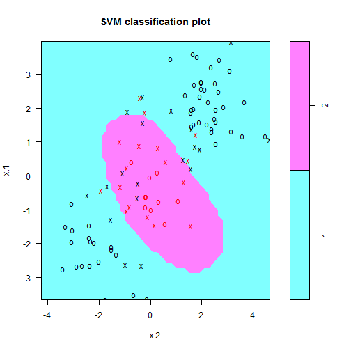 

```r
summary(svmfit)
```

```
## 
## Call:
## svm(formula = y ~ ., data = dat[train, ], kernel = "radial", 
##     gamma = 1, cost = 1)
## 
## 
## Parameters:
##    SVM-Type:  C-classification 
##  SVM-Kernel:  radial 
##        cost:  1 
##       gamma:  1 
## 
## Number of Support Vectors:  37
## 
##  ( 17 20 )
## 
## 
## Number of Classes:  2 
## 
## Levels: 
##  1 2
```

 We can see from the figure that there are a fair number of training errors in this SVM fit. If we increase the value of cost, we can reduce the number of training errors. However, this comes at the price of a more irregular decision boundary that seems to be at risk of overfitting the data.


```r
svmfit = svm(y ~ ., data = dat[train, ], kernel = "radial", gamma = 1, cost = 1e+05)
plot(svmfit, dat[train, ])
```

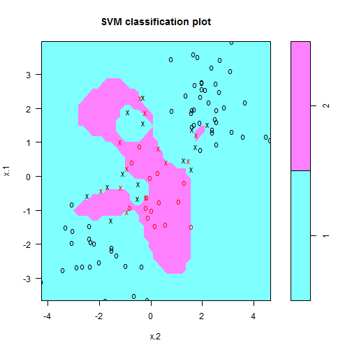 


 We can perform cross-validation using tune() to select the best choice of
and cost for an SVM with a radial kernel:


```r
set.seed(1)
tune.out = tune(svm, y ~ ., data = dat[train, ], kernel = "radial", ranges = list(cost = c(0.1, 
    1, 10, 100, 1000), gamma = c(0.5, 1, 2, 3, 4)))
summary(tune.out)
```

```
## 
## Parameter tuning of 'svm':
## 
## - sampling method: 10-fold cross validation 
## 
## - best parameters:
##  cost gamma
##     1     2
## 
## - best performance: 0.12 
## 
## - Detailed performance results:
##     cost gamma error dispersion
## 1  1e-01   0.5  0.27    0.11595
## 2  1e+00   0.5  0.13    0.08233
## 3  1e+01   0.5  0.15    0.07071
## 4  1e+02   0.5  0.17    0.08233
## 5  1e+03   0.5  0.21    0.09944
## 6  1e-01   1.0  0.25    0.13540
## 7  1e+00   1.0  0.13    0.08233
## 8  1e+01   1.0  0.16    0.06992
## 9  1e+02   1.0  0.20    0.09428
## 10 1e+03   1.0  0.20    0.08165
## 11 1e-01   2.0  0.25    0.12693
## 12 1e+00   2.0  0.12    0.09189
## 13 1e+01   2.0  0.17    0.09487
## 14 1e+02   2.0  0.19    0.09944
## 15 1e+03   2.0  0.20    0.09428
## 16 1e-01   3.0  0.27    0.11595
## 17 1e+00   3.0  0.13    0.09487
## 18 1e+01   3.0  0.18    0.10328
## 19 1e+02   3.0  0.21    0.08756
## 20 1e+03   3.0  0.22    0.10328
## 21 1e-01   4.0  0.27    0.11595
## 22 1e+00   4.0  0.15    0.10801
## 23 1e+01   4.0  0.18    0.11353
## 24 1e+02   4.0  0.21    0.08756
## 25 1e+03   4.0  0.24    0.10750
```


Therefore, the best choice of parameters involves cost=1 and gamma=2.


```r
svmfit = svm(y ~ ., data = dat[train, ], kernel = "radial", gamma = 2, cost = 1)
plot(svmfit, dat[train, ])
```

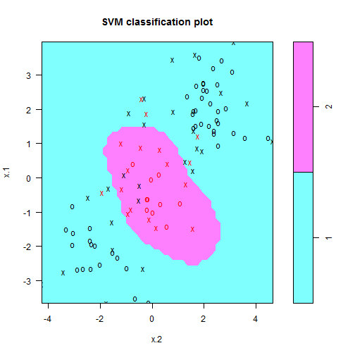 

```r
table(true = dat[-train, "y"], pred = predict(tune.out$best.model, newx = dat[-train, 
    ]))
```

```
##     pred
## true  1  2
##    1 56 21
##    2 18  5
```


 Instead, we will run the SVM on some data where a non-linear boundary is called for. We will use the mixture data from ESL

ROC Curves
--------------


rocplot =function (pred , truth , ...){
+ predob = prediction (pred , truth )
+ perf = performance (predob , "tpr", "fpr")
+ plot(perf ,...)}


```r
library(ROCR)
```

```
## Error: there is no package called 'ROCR'
```

```r
set.seed(1)
x = matrix(rnorm(200 * 2), ncol = 2)
x[1:100, ] = x[1:100, ] + 2
x[101:150, ] = x[101:150, ] - 2
y = c(rep(1, 150), rep(2, 50))
dat = data.frame(x = x, y = as.factor(y))
plot(x, col = y)
```

 

```r

train = sample(200, 100)

test = dat[-train]
# xtest=matrix (rnorm (20*2) , ncol =2) ytest=sample (c(-1,1) , 20,
# rep=TRUE) xtest[ytest ==1 ,]= xtest[ytest ==1,] + 1 testdat =data.frame
# (x=xtest, y=as.factor(ytest)) names(testdat) <- c('X1','X2','y')

svmfit.opt = svm(y ~ ., data = dat[train, ], kernel = "radial", gamma = 2, cost = 1, 
    decision.values = T)

pr = predict(svmfit.opt, dat[train, ], type = "decision")

pred <- prediction(pr, test)
```

```
## Error: could not find function "prediction"
```

```r


pred <- (predict(svmfit.opt, dat[train, ], decision.values = TRUE))
perf <- performance(pred, "tpr", "fpr")
```

```
## Error: could not find function "performance"
```

```r

par(mfrow = c(1, 2))
plot(fitted)
```

```
## Error: $ operator is invalid for atomic vectors
```


n <- 150 # number of data points
p <- 2 # dimension
sigma <- 1 # variance of the distribution
meanpos <- 0 # centre of the distribution of positive examples
meanneg <- 3 # centre of the distribution of negative examples
npos <- round(n/2) # number of positive examples
nneg <- n-npos # number of negative examples
# Generate the positive and negative examples
xpos <- matrix(rnorm(npos*p,mean=meanpos,sd=sigma),npos,p)
xneg <- matrix(rnorm(nneg*p,mean=meanneg,sd=sigma),npos,p)
x <- rbind(xpos,xneg)
# Generate the labels
y <- matrix(c(rep(1,npos),rep(-1,nneg)))
# Visualize the data
plot(x,col=ifelse(y>0,1,2))
legend("topleft",c('Positive','Negative'),col=seq(2),pch=1,text.col=seq(2))
Now we split the data into a training set (80%) and a test set (20%):
## Prepare a training and a test set ##
ntrain <- round(n*0.8) # number of training examples
tindex <- sample(n,ntrain) # indices of training samples
xtrain <- x[tindex,]
xtest <- x[-tindex,]
ytrain <- y[tindex]

ytest <- y[-tindex]
istrain=rep(0,n)
istrain[tindex]=1
# Visualize
plot(x,col=ifelse(y>0,1,2),pch=ifelse(istrain==1,1,2))
legend("topleft",c('Positive Train','Positive Test','Negative Train','Negative Test'),
col=c(1,1,2,2),pch=c(1,2,1,2),text.col=c(1,1,2,2))

# load the kernlab package
library(kernlab)
# train the SVM
svp <- ksvm(xtrain,ytrain,type="C-svc",kernel='vanilladot',C=100,scaled=c())
Look and understand what
svp
contains
# General summary
svp
# Attributes that you can access
attributes(svp)
# For example, the support vectors
alpha(svp)
alphaindex(svp)
b(svp)
# Use the built-in function to pretty-plot the classifier
plot(svp,data=xtrain)


# Predict labels on test
ypred = predict(svp,xtest)
table(ytest,ypred)
# Compute accuracy
sum(ypred==ytest)/length(ytest)
# Compute at the prediction scores
ypredscore = predict(svp,xtest,type="decision")

# Check that the predicted labels are the signs of the scores
table(ypredscore > 0,ypred)
# Package to compute ROC curve, precision-recall etc...
library(ROCR)
pred <- prediction(ypredscore,ytest)
# Plot ROC curve
perf <- performance(pred, measure = "tpr", x.measure = "fpr")
plot(perf)
# Plot precision/recall curve
perf <- performance(pred, measure = "prec", x.measure = "rec")
plot(perf)
# Plot accuracy as function of threshold
perf <- performance(pred, measure = "acc")
plot(perf)


data(ROCR.simple)
pred <- prediction( ROCR.simple$predictions, ROCR.simple$labels )
perf <- performance( pred, "tpr", "fpr" )
plot( perf )


```r
load(url("http://www-stat.stanford.edu/~tibs/ElemStatLearn/datasets/ESL.mixture.rda"))
```

```
## Error: cannot open the connection
```

```r
names(ESL.mixture)
```

```
## Error: object 'ESL.mixture' not found
```

```r
rm(x, y)
attach(ESL.mixture)
```

```
## Error: object 'ESL.mixture' not found
```

 These data are also two dimensional. Lets plot them and fit a nonlinear SVM, using a radial kernel.

```r
plot(x, col = y + 1)
```

```
## Error: object 'x' not found
```

```r
dat = data.frame(y = factor(y), x)
```

```
## Error: object 'y' not found
```

```r
fit = svm(factor(y) ~ ., data = dat, scale = FALSE, kernel = "radial", cost = 5)
```

 Now we are going to create a grid, as before, and make predictions on the grid.
These data have the grid points for each variable included on the data frame.

```r
xgrid = expand.grid(X1 = px1, X2 = px2)
```

```
## Error: object 'px1' not found
```

```r
ygrid = predict(fit, xgrid)
```

```
## Error: object 'x.1' not found
```

```r
plot(xgrid, col = as.numeric(ygrid), pch = 20, cex = 0.2)
```

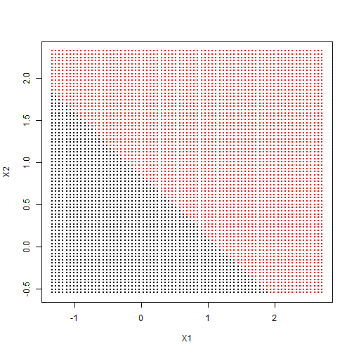 

```r
points(x, col = y + 1, pch = 19)
```

```
## Error: object 'x' not found
```

 We can go further, and have the predict function produce the actual function estimates at each of our grid points. We can include the actual decision boundary on the plot by making use of the contour function. On the dataframe is also `prob`, which is the true probability of class 1 for these data, at the gridpoints. If we plot its 0.5 contour, that will give us the _Bayes Decision Boundary_, which is the best one could ever do.

```r
func = predict(fit, xgrid, decision.values = TRUE)
```

```
## Error: object 'x.1' not found
```

```r
func = attributes(func)$decision
```

```
## Error: object 'func' not found
```

```r
xgrid = expand.grid(X1 = px1, X2 = px2)
```

```
## Error: object 'px1' not found
```

```r
ygrid = predict(fit, xgrid)
```

```
## Error: object 'x.1' not found
```

```r
plot(xgrid, col = as.numeric(ygrid), pch = 20, cex = 0.2)
```

 

```r
points(x, col = y + 1, pch = 19)
```

```
## Error: object 'x' not found
```

```r

contour(px1, px2, matrix(func, 69, 99), level = 0, add = TRUE)
```

```
## Error: object 'px1' not found
```

```r
contour(px1, px2, matrix(prob, 69, 99), level = 0.5, add = TRUE, col = "blue", 
    lwd = 2)
```

```
## Error: object 'px1' not found
```

We see in this case that the radial kernel has done an excellent job.


