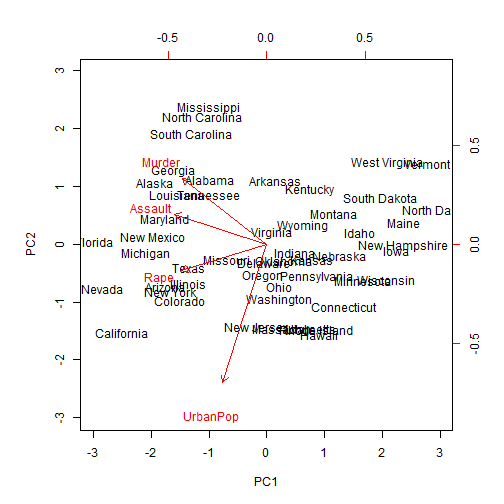
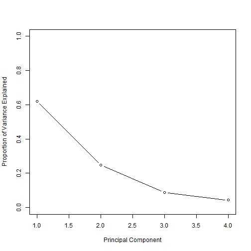
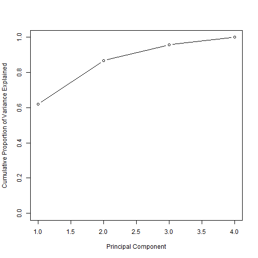
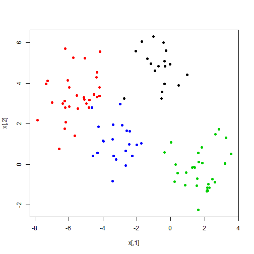
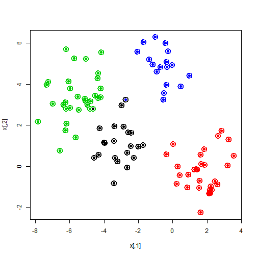
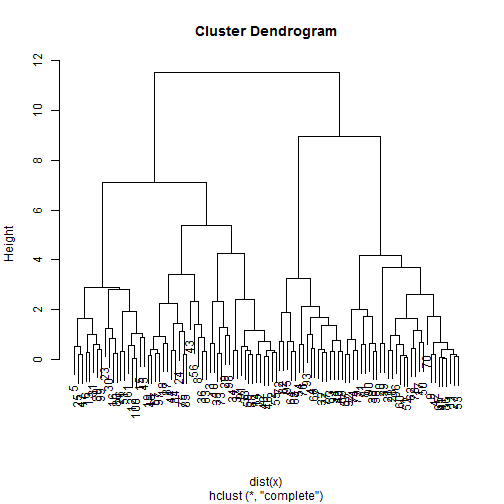
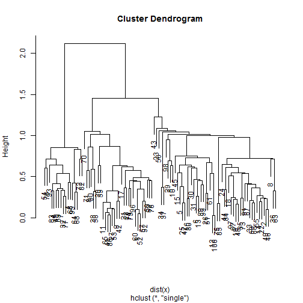
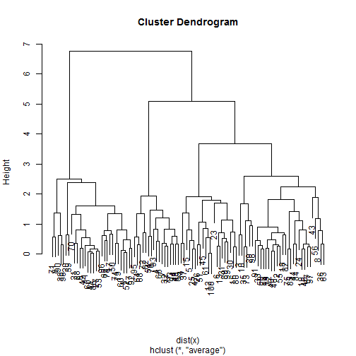
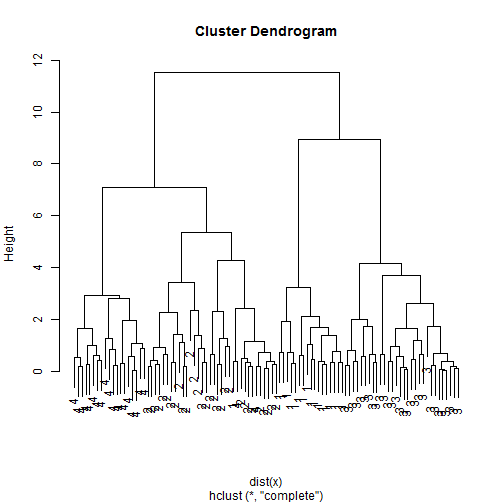

Principal Components
====================
We will use the `USArrests` data (which is in R)

```r
dimnames(USArrests)
```

```
## [[1]]
##  [1] "Alabama"        "Alaska"         "Arizona"        "Arkansas"      
##  [5] "California"     "Colorado"       "Connecticut"    "Delaware"      
##  [9] "Florida"        "Georgia"        "Hawaii"         "Idaho"         
## [13] "Illinois"       "Indiana"        "Iowa"           "Kansas"        
## [17] "Kentucky"       "Louisiana"      "Maine"          "Maryland"      
## [21] "Massachusetts"  "Michigan"       "Minnesota"      "Mississippi"   
## [25] "Missouri"       "Montana"        "Nebraska"       "Nevada"        
## [29] "New Hampshire"  "New Jersey"     "New Mexico"     "New York"      
## [33] "North Carolina" "North Dakota"   "Ohio"           "Oklahoma"      
## [37] "Oregon"         "Pennsylvania"   "Rhode Island"   "South Carolina"
## [41] "South Dakota"   "Tennessee"      "Texas"          "Utah"          
## [45] "Vermont"        "Virginia"       "Washington"     "West Virginia" 
## [49] "Wisconsin"      "Wyoming"       
## 
## [[2]]
## [1] "Murder"   "Assault"  "UrbanPop" "Rape"
```

```r
apply(USArrests, 2, mean)
```

```
##   Murder  Assault UrbanPop     Rape 
##    7.788  170.760   65.540   21.232
```

```r
apply(USArrests, 2, var)
```

```
##   Murder  Assault UrbanPop     Rape 
##    18.97  6945.17   209.52    87.73
```

 
 We see that `Assault` has a much larger variance than the other variables. It would dominate the principal components, so we choose to standardize the variables when we perform PCA

 The **center** and **scale** components correspond to the means and standard deviations of the variables that were used for scaling prior to implementing PCA.
 The rotation matrix provides the principal component loadings; each column
of pr.out$rotation contains the corresponding principal component
loading vector. 


```r
pca.out = prcomp(USArrests, scale = TRUE)
pca.out
```

```
## Standard deviations:
## [1] 1.5749 0.9949 0.5971 0.4164
## 
## Rotation:
##              PC1     PC2     PC3      PC4
## Murder   -0.5359  0.4182 -0.3412  0.64923
## Assault  -0.5832  0.1880 -0.2681 -0.74341
## UrbanPop -0.2782 -0.8728 -0.3780  0.13388
## Rape     -0.5434 -0.1673  0.8178  0.08902
```

```r
names(pca.out)
```

```
## [1] "sdev"     "rotation" "center"   "scale"    "x"
```


The scale=0 argument to biplot() ensures that the arrows are scaled to represent the loadings

```r
biplot(pca.out, scale = 0)
```

 

 We see that there are four distinct principal components. This is to be
expected because there are in general min(n − 1, p) informative principal
components in a data set with n observations and p variables. 
 
 

```r
pca.out$sdev
```

```
## [1] 1.5749 0.9949 0.5971 0.4164
```

```r
pca.var = pca.out$sdev^2
pca.var
```

```
## [1] 2.4802 0.9898 0.3566 0.1734
```

 To compute the proportion of variance explained by each principal component,
we simply divide the variance explained by each principal component
by the total variance explained by all four principal components:


```r
pve = pca.var/sum(pca.var)
pve
```

```
## [1] 0.62006 0.24744 0.08914 0.04336
```


 We see that the first principal component explains 62.0% of the variance in the data, the next principal component explains 24.7% of the variance, and so forth.
 We can plot the PVE explained by each component, as well as the cumulative PVE, as follows:

```r
plot(pve, xlab = " Principal Component ", ylab = " Proportion of Variance Explained ", 
    ylim = c(0, 1), type = "b")
```

 

```r
plot(cumsum(pve), xlab = " Principal Component ", ylab = "Cumulative Proportion of Variance Explained ", 
    ylim = c(0, 1), type = "b")
```

 


K-Means Clustering
==================
K-means works in any dimension, but is most fun to demonstrate in two, because we can plot pictures.
Lets make some data with clusters. We do this by shifting the means of the points around.

```r
set.seed(101)
x = matrix(rnorm(100 * 2), 100, 2)
xmean = matrix(rnorm(8, sd = 4), 4, 2)
which = sample(1:4, 100, replace = TRUE)
x = x + xmean[which, ]
plot(x, col = which, pch = 19)
```

 

We know the "true" cluster IDs, but we wont tell that to the `kmeans` algorithm.


```r
km.out = kmeans(x, 4, nstart = 15)
km.out
```

```
## K-means clustering with 4 clusters of sizes 21, 30, 32, 17
## 
## Cluster means:
##      [,1]    [,2]
## 1 -3.1069  1.1213
## 2  1.7226 -0.2585
## 3 -5.5818  3.3685
## 4 -0.6148  4.8861
## 
## Clustering vector:
##   [1] 2 3 3 4 1 1 4 3 2 3 2 1 1 3 1 1 2 3 3 2 2 3 1 3 1 1 2 2 3 1 1 4 3 1 3
##  [36] 3 1 2 2 3 2 2 3 3 1 3 1 3 4 2 1 2 2 4 3 3 2 2 3 2 1 2 3 4 2 4 3 4 4 2
##  [71] 2 4 3 2 3 4 4 2 2 1 2 4 4 3 3 2 3 3 1 2 3 2 4 4 4 2 3 3 1 1
## 
## Within cluster sum of squares by cluster:
## [1] 30.83 54.48 71.98 21.05
##  (between_SS / total_SS =  87.6 %)
## 
## Available components:
## 
## [1] "cluster"      "centers"      "totss"        "withinss"    
## [5] "tot.withinss" "betweenss"    "size"         "iter"        
## [9] "ifault"
```

```r
plot(x, col = km.out$cluster, cex = 2, pch = 1, lwd = 2)
points(x, col = which, pch = 19)
points(x, col = c(4, 3, 2, 1)[which], pch = 19)
```

 


 To run the kmeans() function in R with multiple initial cluster assignments, we use the nstart argument.
If a value of nstart greater than one is used, then K-means clustering will be performed using multiple random
assignments in Step 1 of Algorithm 10.1, and the kmeans() function will report only the best results.


```r
set.seed(3)
km.out = kmeans(x, 4, nstart = 1)
km.out$tot.withinss
```

```
## [1] 298.4
```

```r

km.out = kmeans(x, 4, nstart = 15)
km.out$tot.withinss
```

```
## [1] 178.3
```

 Note that km.out$tot.withinss is the total within-cluster sum of squares, which we seek to minimize by performing K-means clustering

 We strongly recommend always running K-means clustering with a large value of nstart, such as 20 or 50, since otherwise an undesirable local optimum may be obtained.

Hierarchical Clustering
=======================
We will use these same data and use hierarchical clustering


```r
hc.complete = hclust(dist(x), method = "complete")
plot(hc.complete)
```

 

```r
hc.single = hclust(dist(x), method = "single")
plot(hc.single)
```

 

```r
hc.average = hclust(dist(x), method = "average")
plot(hc.average)
```

 

Lets compare this with the actualy clusters in the data. We will use the function `cutree` to cut the tree at level 4.
This will produce a vector of numbers from 1 to 4, saying which branch each observation is on. You will sometimes see pretty plots where the leaves of the dendrogram are colored. I searched a bit on the web for how to do this, and its a little too complicated for this demonstration.

We can use `table` to see how well they match:

```r
hc.cut = cutree(hc.complete, 4)
table(hc.cut, which)
```

```
##       which
## hc.cut  1  2  3  4
##      1  0  0 30  0
##      2  1 31  0  2
##      3 17  0  0  0
##      4  0  0  0 19
```

```r
table(hc.cut, km.out$cluster)
```

```
##       
## hc.cut  1  2  3  4
##      1  0 30  0  0
##      2  2  0  0 32
##      3  0  0 17  0
##      4 19  0  0  0
```

or we can use our group membership as labels for the leaves of the dendrogram:

```r
plot(hc.complete, labels = which)
```

 

 
